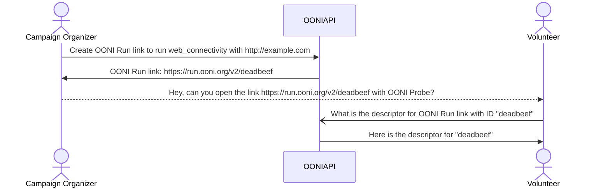

# OONI Run v2 specification

-   author: Norbel Ambanumben, Arturo Filastò
-   version: 2026.08.05
-   status: release-candidate

This document provides a functional specification for OONI Run.

# 1.0 System overview

OONI Run links allow users to coordinate measurement campaigns with
volunteers by sharing a mobile deep link that will instrument the OONI Probe
application to run a set of nettests (or experiments) configured in a certain
way.

Below are definitions for important components of the system:

* **OONI Run link** is a mobile deep link that when clicked or tapped on a system
  with the OONI Probe app installed allows the user to instrument their probe to
  run the nettests configured by the link creator. If the OONI Probe app is not
  installed, it will display a web page asking them to download the app.

* **OONI Run descriptor** contains the metadata for a specific OONI Run link and
  the nettest definitions: what nettests should be run and how they should be
  configured (ex. what URLs should be tested)

* **OONI Run descriptor URL** is the web resource from which the descriptor is
  retrieved.

The high level workflow looks like the following:



It's important to notice how, in the event that the user has the OONI Probe app
installed, a web request to `https://run.ooni.org/v2/deadbeef` will never be
issued on the network, but rather the metadata encoded in the URL itself is used
to retrieve the OONI Run descriptor from a different OONI API endpoint.

When a Volunteer taps on an OONI Run link (in the above example
`https://run.ooni.org/v2/deadbeef`) the OONI Probe app is opened and a they are
presented with the metadata of the OONI Run link as well as the nettests it is
configured with.
At this point, assuming they feel confortable with running the nettests they see
on their screen, they can "install" the OONI Run link inside their app making it
available as new card on the dashboard page allowing them to manually or
automatically run it as part of regular OONI Probe testing.

In a way, an OONI Run link generated card, is very similar to the existing OONI
Probe test groups, except these can be community contributed.

# 2.0 Threat model

The OONI Run service MUST ensure that only the creator of a link is able to
perform UPDATE operations through some form of authentication. It is outside
of the scope of this document to specify the exact details of how authentication
should work, but traditional techniques for implementing authentication should be
used (ex. JWT token sent using appropriate HTTP headers).

Communication with the OONI API MUST be done over a communication channel that
ensures confidentiality, integrity and authenticity of the transmitted content,
such as TLS or onion services.

Whenever a change is made to an OONI Run link, it's important that the end user
is informed about them and the OONI Run link is disabled until they agree with
them. Consent binds to the link *revision*: a new revision (any change to the
metadata, the nettests, their configuration or their `targets_name`) requires
renewed consent, while a new *resolution* of a dynamic target list (see
4.5) does not, because the volunteer consented to the named list, not to the
specific inputs it yielded on a given day. Probes MUST therefore detect changes
by comparing revisions, never by comparing resolved descriptors.

Nettest configuration options whose name starts with `safe_` MAY carry secrets
(for example VPN credentials). Probes MUST make these values available to the
experiment but MUST NOT serialize them into the submitted measurement.

Since the default OONI Probe cards are themselves OONI Run links, a malicious
or compromised revision could redirect a large probe population against
arbitrary endpoints. Stock links MUST be authored by OONI and validated at
creation and update time against the shared target registry (see 3.2); the
revision consent mechanism above applies to them like to any other link.

It is outside of the current scope of this document to prescribe if and how some
level of blocking resistance should be implemented or provided by the system.
That said it's worth noting that since the content of a OONI Run descriptor is
static, it should be possible server it from a mirror that provides higher
levels of blocking resistance (and potentially some higher level of stealth),
such as s3 or github.

# 3.0 OONI Run descriptor

OONI Run descriptors define a set of experiments and configuration vectors used.
It also includes additional metadata used to display a particular OONI Run object
to the end user.

Our goal is to use OONI Run descriptors to implement all the cards currently
present inside of the OONI Probe app. As such we will be having a set of default
OONI Run links that apps will ship with.

An OONI Run link descriptor is a JSON file with the following semantics:

```JavaScript
{
  "name": "(required) `string` is the display name for the OONI Run link",

  // (optional) `map` of translations to language codes for the name
  "name_intl": {
    "it": "Il nome dello OONI Run link in italiano",
  },

  // TODO: recommend a maximum length for this field
  "short_description": "(optional) `string` short_description for the OONI Run link.",

  // (optional) `map` of translations to language codes for the short_description
  "short_description_intl": {},

  "description": "(optional) `string` full description for this OONI Run link. This goes into the details of the card. Markdown is supported.",

  // (optional) `map` of translations to language codes for the description
  "description_intl": {
    "it": "La descrizione del test in italiano"
  },

  "icon": "(optional) `string` the ID of any icon part of the OONI icon set",

  "author": "(optional) `string` name of the creator of this OONI Run link",

  "is_expired": "(optional) `bool` flag indicating that this OONI Run link is expired. An expired link remains retrievable, but it does not lead to tests being initiated",

  // `array` provides a JSON array of tests to be run.
  "nettests":[{

    // (optional) `array` provides a JSON array of inputs for the specified test.
    "inputs": [
      "https://example.com/",
      "https://ooni.org/",
      "https://ooni.io/",
      "https://explorer.ooni.org/",
    ],

    // (optional) `map` of default configuration options for this nettest,
    // applied to every input. For nettests that take no input this is the only
    // configuration surface. See section 3.1 for the configuration model.
    "options": {
      "http3_enabled": false
    },

    // (optional) `array` provides a richer JSON array containing extra parameters for each input.
    // If provided, the length of inputs_extra MUST match the length of inputs.
    // Each entry is overlaid on top of `options` for its input (section 3.1)
    // and MAY carry the reserved target-identity keys of section 3.2.
    "inputs_extra": [{
           "target_id": "example/website",
           "category_code": "HUMR",
    },
    {
        "target_id": "ooni/website",
        "category_code": "HUMR",
    },
    {
        "target_id": "ooni/website",
        "category_code": "HUMR",
    },
    {
        "target_id": "ooni/explorer",
        "category_code": "HUMR",
    }],

   // (optional) `string` naming a backend-generated dynamic input list (see
   // section 3.3). Names are owned and validated by the backend; probes MUST
   // treat them as opaque and MUST NOT validate them against any hardcoded
   // list, so that new names can be introduced without a client update.
   "targets_name": "citizenlab/test_lists",

    // (optional) `bool` indicates if this test should be run as part of autoruns. Defaults to true.
    //
    // Note: this field is currently experimental. A future version of the specification
    // may modify the field name or its semantics if we discover it needs changes.
    "is_background_run_enabled": true,

    // (optional) `bool` indicates if this test should be run as part of manual runs. Defaults to true.
    //
    // Note: this field is currently experimental. A future version of the specification
    // may modify the field name or its semantics if we discover it needs changes.
    "is_manual_run_enabled": true,

    "test_name": "web_connectivity"
  }, {
    "test_name": "openvpn",
    "inputs": [
      "https://riseup-vpn-address.com/"
    ],
    "inputs_extra": [{
         "provider": "riseupvpn",
    }],
  }]
}
```

In reality there are two different views onto an OONI Run link descriptor. One
is the view from the perspective of the creator and owner of the link, the
second is from the perspective of measurement applications that need to consume
these links.

The reason for this is that certain target lists need to be generated
dynamically and at runtime, while the parameters for generating these dynamic
links are specified by the creator of the link.

A prime example of this would be the OONI Run link for the stock OONI Websites
card. The OONI Run descriptor, as specified from the link creator, is saying
"run the test-lists with weights applied based on coverage", while the mobile
application will then receive a prioritized and sorted list which will change
every time a new run is performed.

## 3.1 Configuration model

A nettest is configured through two levels of the same mechanism:

* `options` (optional) is a JSON object of configuration options applied to
  every input of the nettest. For nettests that take no input, it is the only
  configuration surface.

* `inputs_extra` (optional) is an array of JSON objects, index-aligned with
  `inputs`, whose entries are overlaid on top of `options` for the
  corresponding input.

The effective configuration for input *i* is computed by a shallow, field-wise
merge: engine defaults, then `options`, then `inputs_extra[i]`, with later
values winning. Nested objects are replaced, not merged.

Option names and their meaning are defined by each nettest. The following
rules keep authoring mistakes loud and probes forward-compatible:

* Backends MUST reject at CREATE and UPDATE time (with a `4xx`) any option
  name that is not known for the declared `test_name`, whether it appears in
  `options` or in an `inputs_extra` entry. The reserved keys of section 3.2
  are exempt. Without this check, a misspelled option silently does nothing
  in the field.

* Probes MUST ignore option names they do not recognize, so that older probes
  keep working when new options are introduced.

* Option names starting with `safe_` MAY carry secrets and are subject to the
  scrubbing rule of section 2.0.

* Probes MUST record the effective per-input configuration, after the merge,
  excluding `safe_` options, in the submitted measurement inside of the
  `config` key, so that data analysis can condition on what actually ran.

## 3.2 Target identity

An input is an *address*: a URL, hostname or IP endpoint that may rotate
freely between revisions as infrastructure changes. A *target* is the durable
name of the thing being measured. Keeping the two distinct is what allows
measurement series to stay longitudinally comparable while the addresses
underneath them churn.

The following `inputs_extra` keys are reserved across all nettests. They are
consumed by probes and by the data pipeline, are never passed to the
experiment as options, and experiments MUST NOT define options with these
names:

* `target_id` (string, optional): the durable name of the target this input
  belongs to, expressed as a service role (ex. `signal/chat`,
  `whatsapp/endpoints`), never as an address. Multiple inputs sharing one
  `target_id` form a *pool* of redundant members. Distinct `target_id`s
  within one link describe distinct components of a larger service.

* `breaks_service` (bool, optional, defaults to `false`): when true, this
  *target* being down or blocked means the overall service is broken for the
  user, regardless of the state of the other targets. Although it is written
  per input, the flag is a property of the target, which is why all entries
  sharing a `target_id` MUST agree on it.

* `category_code` (string, optional): display metadata following the
  [Citizen Lab category codes](https://github.com/citizenlab/test-lists).
  It is informational only: data analysis derives categorization from its own
  reference data, and this field is not authoritative for it.

The state of a composed link is evaluated in two steps, inputs to targets and
targets to service:

1. A target is reachable if any one of its member inputs is reachable, and it
   is down or blocked only when every member fails. A pool is therefore "one
   working member is enough" by construction.

2. The service is broken when any target with `breaks_service: true` is down
   or blocked. Failures of targets without the flag mean the service is
   degraded rather than broken; how to render degradation is left to the
   probe.

Both classic shapes fall out of this without further vocabulary. Telegram's
datacentre pool is many inputs sharing `telegram/dc_pool`, each with
`breaks_service: true`: reaching a single datacentre means Telegram works,
and only losing all of them breaks it. WhatsApp's registration endpoint is a
single-member target with `breaks_service: true`, which breaks the service on
its own even while the chat pool stays reachable.

The `target_id` vocabulary is maintained in a shared, versioned target
registry, in the same way test lists and blockpage fingerprints are maintained
as community reference data. Within the registry, target ids are append-only:
new ids may be added and old ones deprecated, but an id is never renamed or
re-pointed at a different service role, because measurement series key on it.
A revision that only rotates the addresses under stable `target_id`s changes
what probes contact without changing the identity of what is measured.

Backends MUST validate stock links (the OONI-authored links implementing the
default OONI Probe cards) against the registry at CREATE and UPDATE time,
rejecting unknown `target_id`s. For other links the registry SHOULD be used to
warn rather than reject, since campaign authors may legitimately measure
services the registry does not describe yet.

Probes MAY use `target_id` and `breaks_service` to compute and display the
outcome of a composed link, for example rendering a single card status for a
messaging app whose link measures several pools and services.

## 3.3 Dynamic target lists

`targets_name` names an input list that the backend generates at resolution
time (see 4.5) instead of the list being written into the descriptor. Two
namespaces are defined today:

* `citizenlab/test_lists`: the community test lists, prioritized and sorted
  by the backend for the requesting probe. This is what the stock Websites
  card uses.

* any `target_id` from the target registry (section 3.2): the backend expands
  it to the target's current member addresses and stamps each served input's
  `inputs_extra` entry with the corresponding target-identity keys. A
  composed link can therefore be written entirely without addresses:

  ```JSON
  {
     "test_name": "web_connectivity",
     "targets_name": "whatsapp/endpoints"
  }
  ```

  Rotating a pool's membership then happens in the registry and reaches
  probes as a new resolution, without creating a link revision and without
  triggering renewed consent (see 2.0).

Names are owned and validated by the backend: a CREATE or UPDATE naming an
unknown `targets_name` fails with a `4xx` (see 4.1). Probes MUST treat the
field as opaque and MUST NOT validate it against any hardcoded list, so that
new names, including newly registered targets, can be introduced without a
client update.

Based on the above specification it would be possible to re-implement the cards for the OONI Probe
dashboard as follows.

### Websites

```json
{
"name": "Websites",
"short_description": "Test the blocking of websites",
"description": "Check whether websites are blocked using OONI's [Web Connectivity test](https://ooni.org/nettest/web-connectivity/)...",
"icon": "OONINettestGroupWebsites",
"author": "contact@ooni.org",
"nettests":
   [
      {
         "targets_name": "citizenlab/test_lists",
         "test_name": "web_connectivity"
      }
   ]
}
```

### Instant Messaging

```json
{
"name": "Instant Messaging",
"short_description": "Test the blocking of instant messaging apps",
"description": "Check whether [WhatsApp](https://ooni.org/nettest/whatsapp/), ...",
"icon": "OONINettestGroupInstantMessaging",
"author": "contact@ooni.org",
"nettests":
   [
      {
         "test_name": "whatsapp",
         "is_manual_run_enabled": true,
         "is_background_run_enabled": true,

      },
      {
         "is_manual_run_enabled": true,
         "is_background_run_enabled": true,
         "test_name": "telegram"
      },
      {
         "is_manual_run_enabled": true,
         "is_background_run_enabled": true,
         "test_name": "facebook_messenger"
      },
      {
         "is_manual_run_enabled": true,
         "is_background_run_enabled": true,
         "test_name": "signal"
      },
   ]
}
```

### Circumvention

```json
{
"name": "Circumvention",
"short_description": "Test the blocking of censorship circumvention tools",
"description": "Check whether [Psiphon](https://ooni.org/nettest/psiphon/), ...",
"icon": "OONINettestGroupCircumvention",
"author": "contact@ooni.org",
"nettests":
   [
      {
         "is_manual_run_enabled": true,
         "is_background_run_enabled": true,
         "test_name": "psiphon"
      },
      {
         "is_manual_run_enabled": true,
         "is_background_run_enabled": true,
         "test_name": "tor"
      },
      {
         "is_manual_run_enabled": true,
         "is_background_run_enabled": true,
         "test_name": "riseupvpn"
      }
   ]
}
```

### Performance

```json
{
"name": "Performance",
"short_description": "Test your network speed and performance",
"description": "Measure the speed and performance of your network using the [NDT](https://ooni.org/nettest/ndt/) test. ...",
"icon": "OONINettestGroupPerformance",
"author": "contact@ooni.org",
"nettests":
   [
      {
         "is_manual_run_enabled": true,
         "is_background_run_enabled": true,
         "test_name": "http_invalid_request_line"
      },
      {
         "is_manual_run_enabled": true,
         "is_background_run_enabled": true,
         "test_name": "http_header_field_manipulation"
      },
      {
         "is_manual_run_enabled": true,
         "is_background_run_enabled": false,
         "test_name": "ndt"
      },
      {
         "is_manual_run_enabled": true,
         "is_background_run_enabled": false,
         "test_name": "dash"
      },
   ]
}
```

### Experimental

```json
{
"name": "Experimental",
"short_description": "Run new experimental tests",
"icon": "OONINettestGroupExperimental",
"author": "contact@ooni.org",
"nettests":
   [
      {
         "is_manual_run_enabled": true,
         "is_background_run_enabled": true,
         "test_name": "stun_reachability"
      },
      {
         "is_manual_run_enabled": true,
         "is_background_run_enabled": true,
         "test_name": "dnscheck"
      },
      {
         "is_manual_run_enabled": false,
         "is_background_run_enabled": true,
         "test_name": "tor_snowflake"
      },
      {
         "is_manual_run_enabled": false,
         "is_background_run_enabled": true,
         "test_name": "vanilla_tor"
      },
   ]
}
```

# 4.0 API

In order to support the above workflow the OONI API needs to support the following operations:

* CREATE a new OONI Run link, returning the OONI Run link ID (see 4.1)

* UPDATE an existing OONI Run link (see 4.2)

* GET the OONI Run descriptor, provided an ID (4.3)

In the following sections we will specify how these operations should be done.

By design, we don't specify a delete operation. This is because we want to
ensure there is a permanent record of all OONI Run links that ever existed.

A certain OONI Run link can rendered ineffective by setting the
`expiration_date` to a past date.
In this case the OONI Run link still remains available, but it will not lead to
tests being initiated.

## 4.1 CREATE a new OONI Run link

This operation will be performed by a logged in user that is interested in
performing an OONI Run link based measurement campaign.

It is outside of the scope of this document to specify how registration and
authentication should be handled.

### Request

When you `CREATE` a new OONI RUN link, the client sends a HTTP `POST`
request conforming to the following:

`POST /api/v2/oonirun/links`

```JavaScript
{
"name": "", // (required) `string` is the display name for the OONI Run link

"description": "", // (required) `string` describing the scope of this OONI Run link system

"short_description": "(optional) `string` short_description for the OONI Run link.",

"author": "", // `string` email address of the creator of this OONI Run link

"name_intl": {"it": ""}, // (optional) `string` is the display name for the OONI Run link

"short_description_intl": {}, // (optional) `map` of translations to language codes for the short_description

"description_intl": {"it": ""}, // (optional) `string` describing the scope of this OONI Run link system

"icon": "", // (optional) `string` the ID of any icon part of the OONI icon set

"color": "", // (optional) `string` hex encoding of the 6 hex digit color used for the card prefixed by # (eg. #000000)

"expiration_date": "", // `string` timestamp indiciating at what time the link will expire

"nettests": // `array` provides a JSON array of tests to be run.
   [
      {
         "inputs": [
            "https://example.com/",
            "https://ooni.org/"
         ],
         "inputs_extra": [
            {},
            {}
         ]
         "test_name": "web_connectivity"
      },
      {
         "test_name": "dnscheck"
      }
   ]
}
```

The `inputs_extra` field should be a list of JSON objects, with each object
corresponding to an entry in the `inputs` list. This allows you to attach
additional metadata to each input. The `targets_name` field specifies the name
of a predefined target list that will be used to dynamically generate the inputs
list. This name must be recognized by the backend and agreed upon in advance
between the link creator and the backend system. The semantics of `options` and
`inputs_extra` are specified in section 3.1, and the reserved target-identity
keys in section 3.2.

### Response status code

Upon receiving a request to create a link, the API will respond:

1. SHOULD fail with `4xx` if the request body does not parse, it is not a JSON object,
   any required field is missing and/or if any present field has an invalid value. In particular,
   note that it will error when `targets_name` and `inputs` are provided at the same time in any nettest

2. MUST fail with `4xx` if `inputs_extra` is present and its length does not
   match the length of `inputs`; if `options` or any `inputs_extra` entry
   contains an option name unknown for the declared `test_name` (section 3.1);
   if entries sharing a `target_id` disagree on `breaks_service` (section 3.2);
   if `targets_name` is not a name the backend recognizes (section 3.3); or,
   for stock links, if a `target_id` is unknown to the target registry.

3. if everything is okay, MUST return a `200` response.

### Response body

In case of failure, the OONI Run Service MUST return a JSON object formatted as
`{"error": "string"}` containing details about the encountered error.

In case of success (i.e. `200` response), the OONI Run Service MUST return the
following JSON body:

```JavaScript
{

"title": "",

"description": "",

"author": "",

// [... rest of the OONI Run link payload]

// Additional fields that are added by the backend are:

"oonirun_link_id": "", // `string` OONI Run link identifier.
"is_expired": false, // `string` indicates if the OONI run link has expired
"date_created": "",
"date_updated": "",
"expiration_date": "", // `string` timestamp indiciating at what time the link will expire
"revision": 1, // `int` incremental number indication what revision of the link this is. Whenever changes to the nettests occur a new revision will be generated.
"is_mine": false, // `bool` flag indiciating if the link is owned by the requester
}
```

## 4.2 UPDATE an existing OONI Run link

This operation will be performed by a logged in user that is interested in
performing an OONI Run link based measurement campaign.

It is outside of the scope of this document to specify how registration and
authentication should be handled.

Updating an OONI Run Link means editing any of the fields of an OONI Run link
descriptor. This may involve adding or removing tests, editing targets of
existing ones or making changes to the OONI Run link metadata.

The web UI should discourage users from making changes to the title, icon and
descriptions of OONI Run links as to not confused volunteers that have installed
a link.

### Request

To update an OONI Run Link, the client issues a request compliant the same as the create request.

Below we list the extra fields that are settable from the edit request that are
not settable during CREATE.

`PUT /api/v2/oonirun/links/{ooni_run_link_id}`

```JavaScript
{
   // See create for full semantics
}
```

### Response status code

Upon receiving this request, the OONI Run backend:

1. SHOULD check whether the `${oonirun_link_id}` exists and they have permission to
   edit it and reject the request with a `4xx` status otherwise.

2. SHOULD reject the request with a `4xx` if the JSON does not
   parse or the parsed value is not a JSON object.

3. if everything is okay, returns `200` to the client (see below).

### Response body

In case of failure, the OONI Run Service MUST return a JSON object formatted as
`{"error": "string"}` containing details about the encountered error.

In case of success (i.e. `200` response), the OONI Run Service MUST return the
following JSON body:

```JavaScript
{
"oonirun_link_id": "", // `string` OONI Run link identifier.

"title": "",

"description": "",

"author": "",

// [... rest of the OONI Run link payload]

}
```

## 4.3 GET the OONI Run descriptor

This operation is performed by OONI Probe clients to retrieve the latest
revision for a descriptor of a certain OONI Run link given the ID.

As such, this request does not require any authentication.

### Request

To retrieve an OONI Run link descriptor, the client issues a request compliant with:

`GET /api/v2/oonirun/links/{oonirun_link_id}`

### Response status code

Upon receiving this request, the OONI Run backend:

1. SHOULD check whether the `${oonirun_link_id}` exists and return 404 if it does
   not.

2. if everything is okay, returns `200` to the client (see below).

### Response body

In case of success (i.e. `200` response), the OONI Run Service MUST return the
following JSON body:

```JavaScript
{
   // See CREATE response format for full format.
}
```

Note: This endpoint does not compute dynamic test lists. As a result,
nettests with `targets_name` will always have an empty `inputs` field.


## 4.4 GET the OONI Run full descriptor by revision

This operation is performed by OONI Probe clients to retrieve the descriptor of
a certain OONI Run link given the ID and revision

As such, this request does not require any authentication.

### Request

To retrieve an OONI Run link descriptor, the client issues a request compliant with:

`GET /api/v2/oonirun/links/{oonirun_link_id}/full-descriptor/{revision}`

### Response status code

Same as 4.3 GET the OONI Run descriptor

### Response body

Same as 4.3 GET the OONI Run descriptor

When the specified OONI Run link contains dynamic targets, the `inputs` list may
contain different targets.

## 4.5 POST the OONI Run engine descriptor

This operation is performed by OONI Probe clients to retrieve the engine descriptor of
a certain OONI Run link given the ID and revision

As such, this request does not require any authentication.

This method is used to return just the nettests, revision and date_created
sections of a descriptor to be used by the measurement engine.

When the specified OONI Run link contains dynamic targets, the `inputs` list may
contain different targets.

### Request

To retrieve an OONI Run link descriptor, the client issues a request compliant with:

`POST /api/v2/oonirun/links/{oonirun_link_id}/engine-descriptor/{revision}`
```
{
    "is_charging" : true, // `bool` if the probe is charging or not
    "run_type" : "manual", // `string` valid options: timed | manual

    // The following fields are required for the dynamic tests list calculation
    "probe_cc" : "IT", // `string` country code of the probe
    "probe_asn" : "AS1234", // `string` ASN for the probe,
    "network_type" : "wifi", // `string`
    "website_category_codes" : ["NEWS"], // `array` of strings with category codes used for filtering
}
```
Upon receiving this request, the OONI Run backend:

1. SHOULD check whether the `${oonirun_link_id}` exists and return 404 if it does
   not.

2. if everything is okay, returns `200` to the client (see below).

A client should also include the following headers to allow the server to
properly generate dynamic target lists:

* `X-OONI-Credentials`: base64 encoded OONI anonymous credentials

The `platform`, `software_name`, `software_version`, `engine_name` and
`engine_version` are encoded inside of the `User-Agent` string using the following
format:
```
<software_name>/<software_version> (<platform>) <engine_name>/<engine_version> (<engine_version_full>)
```

### Response body

In case of success (i.e. `200` response), the OONI Run Service MUST return the
following JSON body:

```JavaScript
{
   "revision": "1",
   "date_created": "",
   "nettests": [
      {
         // See CREATE response format for other fields
         "inputs": [
            "https://example.com/"
         ],
         "inputs_extra": [{
            "category_code": "HUMR",
         }],
         "test_name": "web_connectivity"
      }
   ]
}
```
Note: While nettests can't include both `inputs` and `targets_name` during creation,
this endpoint may show both since the backend dynamically populates
`inputs` based on `targets_name`.

The backend computes dynamic test lists only for this request. Other requests will return an empty `inputs` list.

When `targets_name` names a registry `target_id` (section 3.3), the served
`inputs_extra` entries carry the target-identity keys of section 3.2, so the
resolved descriptor is self-describing.

Resolutions are ephemeral by design: they are the output of the
prioritization system, and retaining every served list would grow without
bound. The durable record of what a probe did is the measurements it
submitted, which carry the link id, revision and attempt id (see 5.0). The
tradeoff this accepts is that the *unmeasured* remainder of a served list is
not reconstructible after the fact; questions about why a target went
unmeasured are answered from the prioritization system's own configuration
and rules, not from a log of individual resolutions.

Additionally, the `Vary` header should specify the list of headers that affect
the response body caching, which are all headers starting with the `X-OONI-`
prefix.

The server might also return an updated version of the submitted anonymous
credentials using the `X-OONI-Credentials` header.

## 4.6 LIST the OONI Run descriptors

This operation is performed by users of the OONI Run platform to list all the existing OONI Run links.

Authentication for this endpoint is optional.

### Request

To retrieve an OONI Run link descriptor, the client issues a request compliant with:

`GET /api/v2/oonirun/links?is_mine=true&is_expired=true`

-   `is_mine` , boolean flag to filter only the links of the logged in user. Will only work when the Authentication header is used.
-   `is_expired` , boolean flag used to indicate if the listing should include expired links as well.

### Response status code

Upon receiving this request, the OONI Run backend:

1. SHOULD check whether the `${oonirun_link_id}` exists and return 404 if it does
   not.

2. if everything is okay, returns `200` to the client (see below).

### Response body

In case of success (i.e. `200` response), the OONI Run Service MUST return the
following JSON body:

```JavaScript
{
   "links": [

      // List of OONI Run links, see CREATE response format for full format.
   ]
}
```

# 5.0 Measurement attribution

Probes MUST annotate every measurement produced while running an OONI Run link
with the following annotations:

| annotation | value |
| --- | --- |
| `ooni_run_link_id` | the OONI Run link id |
| `ooni_run_link_revision` | the revision of the descriptor that was run |
| `ooni_run_attempt` | a random UUID minted once per link run and shared by all measurements produced by that run |

This is what ties measurements back to the campaign that produced them. It is
what allows aggregate results to be scoped to a link ("what did the volunteers
of this campaign find") and a link composing several nettests to be
reconstructed after the fact as a single logical check. For dynamically
generated target lists, the measurements submitted under one
`ooni_run_attempt` are also the record of what the resolution served, up to
the inputs the probe did not reach (see 4.5).

Additionally, a top level key called `config` should include the configuration for
the test that was resolved at the `input` level. For example given the following:
```
"options": {
    "http3_enabled": false
}

"inputs_extra": {
    "category_code": "HUMR",
    "safe_value": "something_sekrit"
}
```

and the engine having a default setting for `dot_enabled=true`

The config key shall contain:
```
{
    "config": {
        "http3_enabled": false,
        "category_code": "HUMR",
        "dot_enabled": true
    }
}
```

Note that the `inputs_extra` that was prefixed with `safe_` got stripped.

# 6.0 Implementation considerations

Special attention should be placed in ensuring the OONI Run links (which are
mobile deep links) are sharable though various apps.
In particular the format of the OONI Run link should be such that if the URL is
being truncated, it should be visible to the end, as such it's recommend that we
restrict the character set of the `ooni_run_link_id` to just numbers. Since we
might not end up having that many OONI Run link, this also lends itself well to
allowing users to manually type OONI Run links directly into the app. When manually
typing OONI Run links, the OONI Run link might be displayed broken up into
numbers + spaces or dashes to make it easier to type.

Mobile deep links can be registered using two different methods, one is a custom
prefix (ex. `ooni://`), the other is a custom URL prefix (ex.
`https://run.ooni.org/v2/1234`). In our testing we have seen that the custom prefix
is more reliable, yet it has the tradeoff of not allowing us to display a web
page when the user does not have the app installed. As such the recommended
strategy is to encourage users to share the custom URL prefix OONI Run link, but
on the web page itself, in the event that the app did not handle the deep link,
have a link to the custom prefix approach to "force" the opening of the app
(similar to how OONI Run works now).

As such we recommend using the following addresses for OONI Run link and OONI Run descriptor URLs:

* `https://run.ooni.org/v2/{ooni_run_link_id}`, where `{ooni_run_link_id}` is a number

* `ooni://runv2/{ooni_run_link_id}`

* `https://api.ooni.io/api/v2/oonirun/links/{ooni_run_link_id}`

# 7.0 Future work

The combination semantics of section 3.2 are deliberately limited to pools
plus the `breaks_service` flag. If a real service ever needs more, such as a
k-of-n threshold over a pool or a service that works when either of two
distinct targets does, that is the trigger for a richer combination grammar;
until then, the two-step model stays.

We could at some point host these links on s3 or github and have them
be accessible via URLs in the form:

* `https://raw.githubusercontent.com/ooni/run-links/master/data/{ooni_run_link_id}.json`

* `https://s3.amazonaws.com/ooni-data/ooni-run-links/{ooni_run_link_id}.json`
