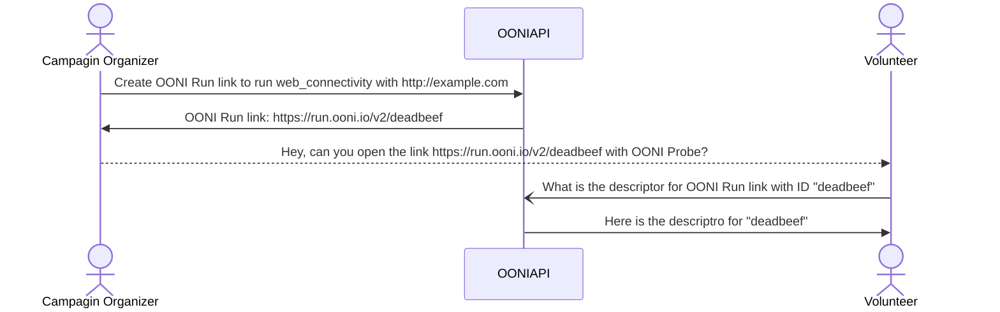

# OONI Run specification

* author: Norbel Ambanumben, Arturo Filastò
* version: 2023.02.09
* status: _draft_

This document provides a functional specification for OONI Run.

# 1.0 System overview

OONI Run links allow users to coordinate measurement campaigns with
volunteers by sharing a mobile deep link that will instrument the OONI Probe
application to run a set of nettests (or experiments) configured in a certain
way.

Below are definitions for important components of the system:

* **OONI Run link** is a mobile deep link that when clicked or tapped on a system
  with the OONI Probe app installed allows the user to instrument their probe to
  run the nettests configured by the link creator. If the OONI Probe app is not
  installed, it will display a web page asking them to download the app.
  
* **OONI Run descriptor** contains the metadata for a specific OONI Run link and
  the nettest definitions: what nettests should be run and how they should be
  configured (ex. what URLs should be tested)

* **OONI Run descriptor URL** is the web resource from which the descriptor is
  retrieved.

The high level workflow looks like the following:



It's important to notice how, in the event that the user has the OONI Probe app
installed, a web request to `https://run.ooni.org/io/v2/deadbeef` will never be
issued on the network, but rather the metadata encoded in the URL itself is used
to retrieve the OONI Run descriptor from a different OONI API endpoint.

When a Volunteer taps on an OONI Run link (in the above example
`https://run.ooni.io/v2/deadbeef`) the OONI Probe app is opened and a they are
presented with the metadata of the OONI Run link as well as the nettests it is
configured with.
At this point, assuming they feel confortable with running the nettests they see
on their screen, they can "install" the OONI Run link inside their app making it
available as new card on the dashboard page allowing them to manually or
automatically run it as part of regular OONI Probe testing.

In a way, an OONI Run link generated card, is very similar to the existing OONI
Probe test groups, except these can be community contributed.

# 2.0 Threat model

The OONI Run service MUST ensure that only the creator of a link is able to
perform UPDATE operations through some form of authentication. It is outside
of the scope of this document to specify the exact details of how authentication
should work, but traditional techniques for implementing authentication should be
used (ex. JWT token sent using appropriate HTTP headers).

Communication with the OONI API MUST be done over a communication channel that
ensures confidentiality, integrity and authenticity of the transmitted content,
such as TLS or onion services.

Whenever a change is made to an OONI Run link, it's important that the end user
is informed about them and the OONI Run link is disabled until they agree with
them.

It is outside of the current scope of this document to prescribe if and how some
level of blocking resistance should be implemented or provided by the system.
That said it's worth noting that since the content of a OONI Run descriptor is
static, it should be possible server it from a mirror that provides higher
levels of blocking resistance (and potentially some higher level of stealth),
such as s3 or github.

# 3.0 OONI Run descriptor

OONI Run descriptors define a set of experiments and configuration vectors used.
It also includes additional metadata used to display a particular OONI Run object
to the end user.

Our goal is to use OONI Run descriptors to implement all the cards currently
present inside of the OONI Probe app. As such we will be having a set of default
OONI Run links that apps will ship with.

An OONI Run link descriptor is a JSON file with the following semantics:
```json
{
"name": "(required) `string` is the display name for the OONI Run link",
// (optional) `map` of translations to language codes for the name
"name_intl": {
   "it": "Il nome del test in italiano",
},
// TODO: recommend a maximum length for this field
"short_description": "(optional) `string` short_description for the OONI Run link.",
// (optional) `map` of translations to language codes for the short_description
"short_description_intl": {},
"description": "(optional) `string` full description for this OONI Run link. This goes into the details of the card. Markdown is supported.",
// (optional) `map` of translations to language codes for the description
"description_intl": {
   "it": "La descrizione del test in italiano"
},
"icon": "(optional) `string` the ID of any icon part of the OONI icon set",
"author": "(optional) `string` name of the creator of this OONI Run link",
// `array` provides a JSON array of tests to be run.
"nettests":
   [
      {
         // (optional) `array` provides a JSON array of tests to be run.
         "inputs": [
            "https://example.com/",
            "https://ooni.org/"
         ],
         // (optional) `map` options arguments provided to the specified test_name
         "options": {
            "HTTP3Enabled": true,
         },
         // (optional) `map` settings which are sent to probe_services for retrieving the inputs vector
         // It's possible to reference user configured settings by using accessing the 
         // $settings special variable.
         // In particular the content of the test_settings will be sent to the /api/v1/check-in call nested 
         // under the relative test_name.
         "test_settings": {
            "category_codes": "$settings.category_codes"
         },
         // (optional) `bool` indicates if this test should be run as part of autoruns. Defaults to true.
         "is_background_run_enabled": true,
         // (optional) `bool` indicates if this test should be run as part of manual runs. Defaults to true.
         "is_manual_run_enabled": true,
         "test_name": "web_connectivity"
      },
      {
         "test_name": "openvpn",
         "test_settings": {
            "provider": "riseupvpn"
         },
      }
   ],
}
```

Based on the above specification it would be possible to re-implement the cards for the OONI Probe
dashboard as follows:

### Websites

```json
{
"name": "Websites",
"short_description": "Test the blocking of websites",
"description": "Check whether websites are blocked using OONI's [Web Connectivity test](https://ooni.org/nettest/web-connectivity/)...",
"icon": "OONINettestGroupWebsites",
"author": "contact@ooni.org",
"nettests":
   [
      {
         "options": {
            "MaxRuntime": "$settings.max_runtime",
         },
         "test_settings": {
            "category_codes": "$settings.category_codes"
         },
         "is_manual_run_enabled": true,
         "is_background_run_enabled": false,
         "test_name": "web_connectivity"
      },
      {
         "test_settings": {
            "category_codes": "$settings.category_codes"
         },
         "is_manual_run_enabled": false,
         "is_background_run_enabled": true,
         "test_name": "web_connectivity"
      },
   ]
}
```

### Instant Messaging

```json
{
"name": "Instant Messaging",
"short_description": "Test the blocking of instant messaging apps",
"description": "Check whether [WhatsApp](https://ooni.org/nettest/whatsapp/), ...",
"icon": "OONINettestGroupInstantMessaging",
"author": "contact@ooni.org",
"nettests":
   [
      {
         "test_name": "whatsapp"
      },
      {
         "test_name": "telegram"
      },
      {
         "test_name": "facebook_messenger"
      },
      {
         "test_name": "signal"
      },
   ]
}
```

### Instant Messaging

```json
{
"name": "Circumvention",
"short_description": "Test the blocking of censorship circumvention tools",
"description": "Check whether [Psiphon](https://ooni.org/nettest/psiphon/), ...",
"icon": "OONINettestGroupCircumvention",
"author": "contact@ooni.org",
"nettests":
   [
      {
         "test_name": "psiphon"
      },
      {
         "test_name": "tor"
      },
      {
         "test_name": "riseupvpn"
      }
   ]
}
```

### Performance

```json
{
"name": "Performance",
"short_description": "Test your network speed and performance",
"description": "Measure the speed and performance of your network using the [NDT](https://ooni.org/nettest/ndt/) test. ...",
"icon": "OONINettestGroupPerformance",
"author": "contact@ooni.org",
"nettests":
   [
      {
         "test_name": "http_invalid_request_line"
      },
      {
         "test_name": "http_header_field_manipulation"
      },
      {
         "test_name": "ndt"
      },
      {
         "test_name": "dash"
      },
   ]
}
```

### Experimental

```json
{
"name": "Experimental",
"short_description": "Run new experimental tests",
"icon": "OONINettestGroupExperimental",
"author": "contact@ooni.org",
"nettests":
   [
      {
         "test_name": "stun_reachability"
      },
      {
         "test_name": "dnscheck"
      },
      {
         "is_manual_run_enabled": false,
         "test_name": "tor_snowflake"
      },
      {
         "is_manual_run_enabled": false,
         "test_name": "vanilla_tor"
      },
   ]
}
```

# 4.0 API

In order to support the above workflow the OONI API needs to support the following operations:
* CREATE a new OONI Run link, returning the OONI Run link ID (see 4.1)
* UPDATE an existing OONI Run link (see 4.2)
* GET the OONI Run descriptor, provided an ID (4.3)

In the following sections we will specify how these operations should be done.

TODO(discuss): Do we want to support a delete operation? I would say we probably
do not, since a user should always have access to the OONI Run link which they
have configured on their device, if we do support deleting them, they might be
surprised to see it disappear from their device in the future.

## 4.1 CREATE a new OONI Run link

This operation will be performed by a logged in user that is interested in
performing an OONI Run link based measurement campaign.

It is outside of the scope of this document to specify how registration and
authentication should be handled.

### Request

When you `CREATE` a new OONI RUN link, the client sends a HTTP `POST`
request conforming to the following:

`POST /api/v1/ooni_run`

```json
{
"name":
   (required) `string` is the display name for the OONI Run link

"description":
   (optional) `string` describing the scope of this OONI Run link system

"icon":
   (optional) `string` the ID of any icon part of the OONI icon set

"author":
   (optional) `string` name of the creator of this OONI Run link

"nettests": `array` provides a JSON array of tests to be run.
   [
      {
         "inputs": [
            "https://example.com/",
            "https://ooni.org/"
         ],
         "options": {
            "HTTP3Enabled": true,
         },
         "test_name": "web_connectivity"
      },
      {
         "test_name": "dnscheck"
      }
   ]
}
```


### Response status code

Upon receiving a request to create a link, the API will respond:

1. SHOULD fail with `4xx` if the request body does not parse, it is not a JSON object,
   any required field is missing and/or if any present field has an invalid value.

2. if everything is okay, MUST return a `200` response.

### Response body

In case of failure, the OONI Run Service MUST return a JSON object formatted as
`{"error": "string"}` containing details about the encountered error.

In case of success (i.e. `200` response), the OONI Run Service MUST return the
following JSON body:

```json
{
"ooni_run_link_id":
   `string` OONI Run link identifier.

"title": "",

"description": "",

"author": "",

[... rest of the OONI Run link payload]

}
```

## 4.2 UPDATE an existing OONI Run link

This operation will be performed by a logged in user that is interested in
performing an OONI Run link based measurement campaign.

It is outside of the scope of this document to specify how registration and
authentication should be handled.

Updating an OONI Run Link means editing any of the fields of an OONI Run link
descriptor. This may involve adding or removing tests, editing targets of
existing ones or making changes to the OONI Run link metadata.

The web UI should discourage users from making changes to the title, icon and
descriptions of OONI Run links as to not confused volunteers that have installed
a link.

### Request

To update an OONI Run Link, the client issues a request compliant with:

`PUT /api/v1/ooni_run/{ooni_run_link_id}`

```json
{
"name":
   (required) `string` is the display name for the OONI Run link

"description":
   (optional) `string` describing the scope of this OONI Run link system

"icon":
   (optional) `string` the ID of any icon part of the OONI icon set

"author":
   (optional) `string` name of the creator of this OONI Run link

"nettests": `array` provides a JSON array of tests to be run.
   [
      {
         "inputs": [
            "https://example.com/",
            "https://ooni.org/",
            "https://torproject.org/"
         ],
         "options": {
            "HTTP3Enabled": true,
         },
         "test_name": "web_connectivity"
      },
      {
         "test_name": "dnscheck"
      }
   ]
}
```

### Response status code

Upon receiving this request, the OONI Run backend:

1. SHOULD check whether the `${ooni_run_id}` exists and they have permission to
   edit it and reject the request with a `4xx` status otherwise.

2. SHOULD reject the request with a `4xx` if the JSON does not
   parse or the parsed value is not a JSON object.

3. if everything is okay, returns `200` to the client (see below).

### Response body

In case of failure, the OONI Run Service MUST return a JSON object formatted as
`{"error": "string"}` containing details about the encountered error.

In case of success (i.e. `200` response), the OONI Run Service MUST return the
following JSON body:

```json
{
"ooni_run_link_id":
   `string` OONI Run link identifier.

"title": "",

"description": "",

"author": "",

[... rest of the OONI Run link payload]

}
```

## 4.3 GET the OONI Run descriptor

This operation is performed by OONI Probe clients to retrieve the descriptor of
a certain OONI Run link given the ID.

As such, this request does not require any authentication.

### Request

To retrieve an OONI Run link descriptor, the client issues a request compliant with:

`GET /api/v1/ooni_run/{ooni_run_link_id}`

### Response status code

Upon receiving this request, the OONI Run backend:

1. SHOULD check whether the `${ooni_run_id}` exists and return 404 if it does
   not.

2. if everything is okay, returns `200` to the client (see below).

### Response body

In case of success (i.e. `200` response), the OONI Run Service MUST return the
following JSON body:

```json
{
"ooni_run_link_id":
   `string` OONI Run link identifier.

"name":
   (required) `string` is the display name for the OONI Run link

"description":
   (optional) `string` describing the scope of this OONI Run link system

"icon":
   (optional) `string` the ID of any icon part of the OONI icon set

"author":
   (optional) `string` name of the creator of this OONI Run link

"nettests": `array` provides a JSON array of tests to be run.
   [
      {
         "inputs": [
            "https://example.com/",
            "https://ooni.org/"
         ],
         "options": {
            "HTTP3Enabled": true,
         },
         "test_name": "web_connectivity"
      },
      {
         "test_name": "dnscheck"
      }
   ]
}
```

# 5.0 Implementation considerations

Special attention should be placed in ensuring the OONI Run links (which are
mobile deep links) are sharable though various apps.
In particular the format of the OONI Run link should be such that if the URL is
being truncated, it should be visible to the end, as such it's recommend that we
restrict the character set of the `ooni_run_link_id` to just numbers. Since we
might not end up having that many OONI Run link, this also lends itself well to
allowing users to manually type OONI Run links directly into the app.

Mobile deep links can be registered using two different methods, one is a custom
prefix (ex. `ooni://`), the other is a custom URL prefix (ex.
`https://run.ooni.io/1234`). In our testing we have seen that the custom prefix
is more reliable, yet it has the tradeoff of not allowing us to display a web
page when the user does not have the app installed. As such the recommended
strategy is to encourage users to share the custom URL prefix OONI Run link, but
on the web page itself, in the event that the app did not handle the deep link,
have a link to the custom prefix approach to "force" the opening of the app.

As such we recommend using the following addresses for OONI Run link and OONI Run descriptor URLs:
* `https://run.ooni.io/{ooni_run_link_id}`, where `{ooni_run_link_id}` is a number
* `ooni://runv2/{ooni_run_link_id}`
* `https://api.ooni.io/api/v1/ooni_run/{ooni_run_link_id}`

Moreover, we could at some point host these links on s3 or github and have them
be accessible via URLs in the form:
* `https://raw.githubusercontent.com/ooni/run-links/master/data/{ooni_run_link_id}.json`
* `https://s3.amazonaws.com/ooni-data/ooni-run-links/{ooni_run_link_id}.json`
