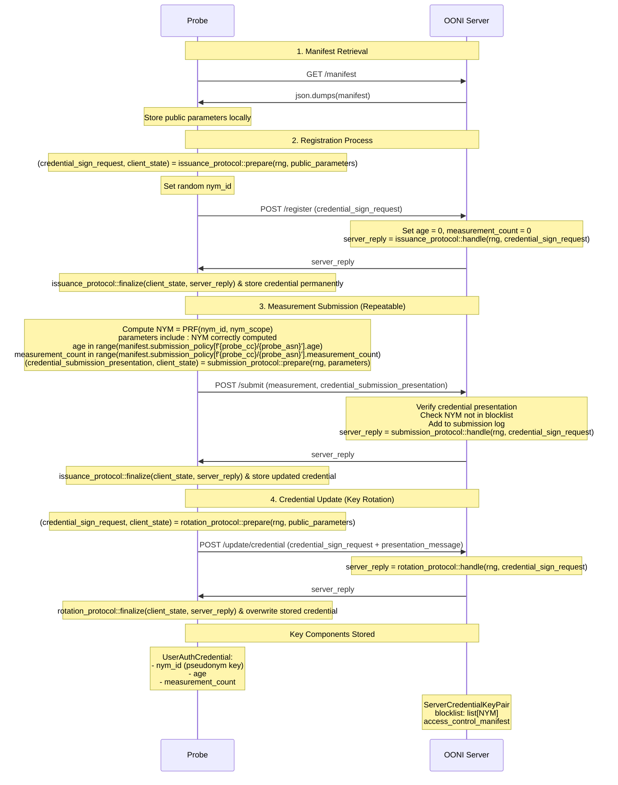

# OONI Anonymous Credentials Protocol

-   author: Michele Orrù, Arturo Filastò
-   version: 2025.06.02
-   status: draft

## Overview

The anonymous credentials system will involve adding some new backend API endpoints and modifying existing ones.

The following diagram shows the overview of the endpoints:

This credential will then be used as part of the "Submit Measurement" call to prove to the backend certain properties about itself. The backend will then return the new updated credential as part of this.

## Objects

Runtime shared variables:

- `nym_scope = "ooni.org/{probe_cc}/{probe_asn}"`

  Is a format string, to be filled later by the user and the server during the presentation of a credential.

User stores permanently `UserAuthCredential` with attributes:

- `nym_id` (the pseudonym key, jointly created at issuance by user and server);
- `age` (public, known by both)
- `measurement_count`  (public, known by both)

Server stores permanently the credential signing key pair `ServerCredentialKeyPair`.

Public parameters (stored by the user and by the server):

- `public_parameters`, `credential_signing_key` (may change)
- `access_control_manifest` (changes)

Within a measurement submission we store, but never change:

- `measurement_count: u32`
- `NYM = PRF(nym_id, nym_scope): [u8; 32]`
- `blocklist: list[NYM: [u8; 32]]`

## API Endpoints

All assumed to be performed over HTTPS.

### Manifest

- `/manifest`

  **What happens:** Return the public parameters, including a list of attribute names and the access policies that are in place for each endpoint. This page is a summary of the access policies that all users have to follow in order to log in. They are meant to transparently state what information the user is revealing.

  **Example manifest**

```js
{
    "public_key": "some_key", // A string used as public key for signing credentials 
    "nym_scope": "ooni.org/{probe_cc}/{probe_asn}",
    "public_parameters": "0xdeadbeef",
 	"submission_policy": {
        "NL/AS9080": {"age": [5, 10], "measurement_count": 100},
        "US": {"measurement_count": 10}
    },
 	"version": "0.1-b13a37b4b3"
}
```

  **Protocol overview:**
`USER: "GET /manifest"`

1. Send an HTTP get request.
2. The server parses the request and responds with the JSON string `access_policy_manifest`

**Space requirements:**
The public parameters are then stored by the client and part of the internal state of the user.
The public parameters will be `(number of attributes of the credentials + 2) * 32B (eg. (3 + 2) * 32 = 192)`. A safe estimate is 300B of public parameters.

**Computation requirements**:
This page is meant to be computed once and then served statically. No cryptographic operations are performed.

For user anonymity, it is important to be able to share the same view over this page.
There are many different mechanisms for that could implement it:

1. Rely on the PKI infrastructure.

   The HTTPS certificate now has an extra record with the public parameters of the credential system. Changes to the credential systems will require changing the HTTPS certificate and the transparency logs for HTTPS would record this change, making it impossible for OONI to issue two credentials with two different public parameters to two different users.

2. Rely on a public ledger.
   A public archive such as [archive.org](http://archive.org), a blockchain, or something that is external to OONI and where people can have an established view of the public parameters.
- Fetch the public parameters via an anonymity network such as Tor (very weak guarantees)

### Core Endpoints

#### `register/`

**What happens:** Issues a new credential to the user using the given attributes. The user checks that the credential is valid and stores it locally. The user is meant to keep the credential private and never reveal it. If a credential is revealed, the anonymity of the user is compromised.

At registration time, the user can be presented with human challenges to solve.

**Protocol overview:**

1. **User sends credential request:**
   ```
   POST register/
   credential_sign_request
   ```
   - "create_sign_request" sends a credential request with random field "nym_id"

2. **Server processes and responds:**
   ```
   SERVER: credential_sign_response
   ```
   - Set the attributes "age" and "measurement_count" in the credential request
   - Re-randomize attribute "nym_id"
   - Sign the credential and send it over

3. **User validates and stores credential:**
   ```
   USER: credential
   ```
   - Check that the public attributes "age" and "measurement_count" are set correctly
   - Unblind the credential and store it permanently

**Space requirements:**
- `credential_sign_request`: ~200-300B
- `credential_sign_response`: ~200-300B
- Final credential: ~32B per attribute + 64B for the credential itself
- Total storage requirement: ~400B (credential + attributes), stored permanently by the user

**Computation requirements:**
A few MSMs (Multi-Scalar Multiplications) are required on both ends. Expected performance: <5ms for both user and server.

---

#### `submit/`

**What happens:** User submits a measurement using an OONI credential. The user proves that the credential is correct and that the pseudonym and measurement count present in the credential are valid for the credential presented. The server will accept the submission only if all checks are satisfied.

**Protocol overview:**

1. **User prepares submission:**
   ```
   POST submit/
   ```
   - Let `measurement` be the OONI measurement
   - Compute `NYM = PRF(nym_id, nym_scope.format(measurement.probe_cc, measurement.probe_asn))`
   - Compute a credential signing request with:
     - `new.nym_id = old.nym_id`
     - `new.age = old.age`
     - `new.measurement_count = old.measurement_count + 1`

2. **User sends:**
   - Credential version
   - Measurement
   - `presentation_message` for the predicate:
     - NYM is correctly computed: `PRF(UserAuthCredential.nym_id, nym_scope.format(probe_cc, probe_asn)) = NYM`
     - `age_lsb < 2^10` (range proof)
     - `measurement_count_lsb < 2^10` (range proof)

3. **Server validates and responds:**
   ```
   SERVER: decision
   ```
   - Check the credential `presentation_message` against NYM
   - Check NYM not in blocklist
   - Add `submission.NYM = NYM`
   - Add `submission.measurement_count_msb = measurement_count_msb`
   - Add submission to log
   - Respond with `credential_sign_response`

4. **User updates credential:**
   ```
   USER: credential update
   ```
   - Finalize `credential_sign_response` and store `UserAuthCredential`

**Space requirements:**
- `presentation_message` size: `num_hidden_attributes * 64B + 3 + |range_proof|`
- Total: <1KB (base64 encoding of 1KB = 1,368 bytes)

**Computation requirements:**
- Credential validity check: a few milliseconds
- Pseudonym validation and blocklist check: depends on file size, expected <5ms

---

### Update and Key Rotation

#### `update/credential`

**What happens:** Performs key rotation of the `credential_signing_key` of the server. The user presents a valid credential under some previous signing key and some new credential request. It proves (in zero-knowledge) that the hidden attributes are the same in the credential and the credential request. The server verifies the proofs and returns a `credential_sign_response` for the new credential.

This endpoint is useful for key rotation in case of compromise of the credential key, but also in case of attacks where users can be forced to go through an update step. This step inevitably will partition the anonymity set and mitigate access to the submission server. During the credential update, one can also present the user with a human challenge.

**Protocol overview:**
```
USER: POST update/credential
credential_sign_request, presentation_message

SERVER: credential_sign_response
```

**Space requirements:**
A safe estimate is to consider the sizes of credential sign request and presentation message discussed previously (<1KB for the user message, 200-300B for the response). At the end, the user will overwrite the credential in local storage.

**Computation requirements:**
A safe estimate is to consider the computation of the messages discussed previously.

## Security considerations

The security (pseudorandomness) properties of the PRF will affect security of the system. In practice, we can consider:

- Naor-Reingold-Pinkas: will give us 128-bit pre-quantum security
  - Low code overhead
  - Little tweaks and flexibility
- Dodis-Yampolskiy: will give us about 100bit pre-quantum security
  - Low code overhead
  - Allow for extensive tweaking, e.g. proving some private inputs of the PRF
- AES-256: will give us 128 post-quantum security
  - Large code overhead (\>1’000 lines of dependency code)
  - Allows for extensive tweaking

We must make sure that the credential update function does not allow us to spawn
two different credentials with the same trust level, and another concern is if
anonymity is preserved with the presentation and credential\_sign messages sent
at once . This can be enforced by maintaining the same UID across the lifetime
of the credential.
