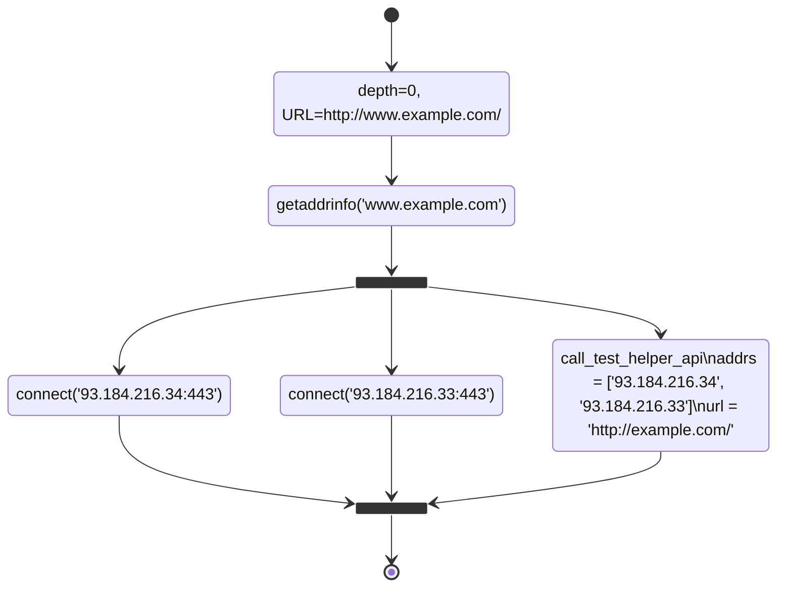
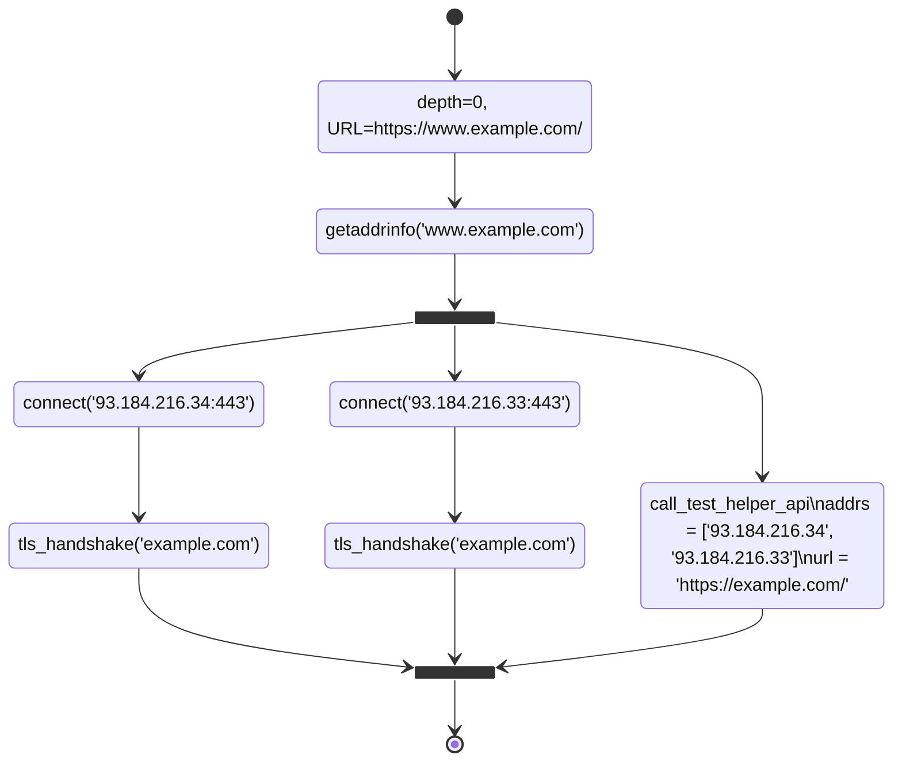
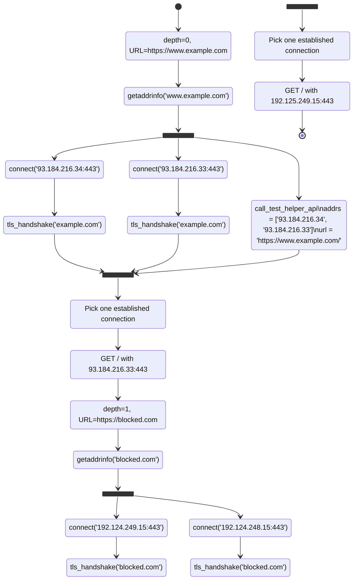

# Web Connectivity

## Specification version number

2024-02-14-001

* _status_: current

## Specification name

Web Connectivity (`web_connectivity`)

## Test preconditions

* An internet connection;

* The ability to reach the Web Connectivity test helper (TH).

## Expected impact

Ability to detect if the websites being tested are reachable and if not what are
some of the reasons for them not being reachable.

## Expected inputs

In OONI Probe CLI, you typically run Web Connectivity without any input as follows:

```bash
ooniprobe run websites
```

which is equivalent to running the corresponding "websites" group in the Android,
iOS, and Desktop OONI Probe applications.

When you run Web Connectivity like this, it connects to the OONI backend before the beginning
of the experiment and fetches the list of URLs to be tested. In such a case, you're getting
a list of URLs based on [the citizenlab/test-lists repository](https://github.com/citizenlab/test-lists)
that depend on your contry code, network, and URL prioritization algorithms.

It is also possible for you to manually specify which URLs to test from the command line:

```bash
ooniprobe run websites --input https://www.example.com/
```

It is also possible for you to create a file containing one line for each URL, e.g.:

```text
https://example.com/
https://example.it/path/
https://example.fr/a/longer/path/
https://example.org/
https://93.184.216.34/
https://[2606:2800:220:1:248:1893:25c8:1946]:443/
```

and run it as follows:

```bash
ooniprobe run websites --input-file FILE_NAME.txt
```

URLs may contain IP addresses rather than domain names. IPv6 addresses should be quoted using `[`
and `]` when there's a need to also specify a port (as illustrated above).

When using the `miniooni` research client, you run Web Connectivity as follows:

```bash
miniooni web_connectivity
```

You measure a specific URL as follows:

```bash
miniooni web_connectivity --input https://www.example.com/
```

You measure a list of URLs as follows:

```bash
miniooni web_connectivity --input-file INPUT_FILE.txt
```

## Test description

Since we first specified this test, its implementation has changed significantly
to improve our censorship detection capabilities. We will first describe the "classic"
algorithm implemented by Web Connectivity and then proceed to explain extensions
designed to collect additional information useful to characterize censorship. After
that, we specify how OONI Probe should process Web Connectivity results, to determine
whether the URL is accessible or there's blocking in place. (Note that the
OONI backend is better positioned to determine blocking and accessibility given that
it can cross compare measurements and apply fingerprints.)

### The classic algorithm

As a preliminary step, Web Connectivity performs an IPv4 resolver lookup step. We
query for `whoami.v4.powerdns.org` using the system resolver and we record the resolved
address in the `client_resolver` test key. Because modern OONI Probe implementations
perform this step by default for all experiments, modern implementations of
Web Connectivity read the `client_resolver` from the measurement session.

After that, there are two steps: the "connectivity" step and the "web" step.

#### The connectivity step

The objectives of this step are the following:

1. to discover IP addresses for the domain in the input URL using a specific
resolver (typically, the "system" resolver using `getaddrinfo` on Unix, so that we
end up using the DNS resolver configured on the system);

2. to query the Web Connectivity test helper (TH) providing to it the URL to
measure as well as the resolved IP addresses, such that we can have control
information to which to compare our measurement;

3. to establish TCP connections to all the endpoints constructed by appending
the scheme's port (`80` for `http` and `443` for `tcp`) or the custom port
specified in the URL;

4. optionally, to establish TLS connections to all these endpoints.

We call this step the "connectivity" step because it determines whether we're
able to establish TCP/TLS connections with the IP addresses associated with the domain
inside the URL. When the URL does not contain a domain but rather contains an
IP address, the first step of the algorithm just returns the IP address itself
and we're using the address to validate the TLS certificate.

The following diagram illustrates the set of operations performed by the
classic algorithm for `http://` like URLs:



The two small black squares in the diagram represent, respectively, starting several
operations in parallel and awaiting for these operations to complete. We set specific
timeouts for each parallel operation.

Instead, the following diagram illustrates what happens for `https://` like URLs:



When the `getaddrinfo` lookup fails, the algorithm still invokes the test helper
and passes an empty array of discovered IP addresses. Historically, Web Connectivity
does not use IP addresses returned by the test helper to measure connectivity, but
modern versions do that as an extension to the classic algorithm.

#### The web step

Web Connectivity constructs an HTTP client configured to honour cookies and to follow redirects,
and uses such a client to fetch the webpage associated with the input URL. Historically, Web
Connectivity does not reuse the connections established during the connectivity step to GET
the provided URL, but modern versions do that as an extension, to avoid the need
to re-establish new connections from scratch. We call this step the "web" step because
its goal is to fetch a webpage for the input URL.

#### Data collected by these steps

The connectivity step collects these information:

1. `df-002-dns.md` information (stored inside the `queries` test key) when
performing the DNS lookup. Note that, when the URL already contains an IP address,
Web Connectivity MAY fake a DNS lookup, however, this behavior is NOT RECOMMENDED
because it could possibly lead to confusion when looking at the data.

2. `df-005-tcpconnect.md` information (stored inside `tcp_connect`) and with
the `tcptls_handshake` tag set. This information pertains to all
the TCP connect operations performed during the connectivity step.

3. `df-006-tlshandshake.md` information (stored inside `tls_handshakes`)
and with the `tcptls_handshake` tag set. This information pertains
to all the TLS handshake operations performed during the connectivity step.

4. `df-008-netevents.md` information (stored inside `network_events`)
and with the `tcptls_handshake` tag set. This information pertains to all
the socket I/O operations performed during the TLS handshakes of the connectivity
step and could be used by the OONI backend to detect throttling.

The web step collects these information:

1. `df-001-http.md` information (stored inside the `requests` test key). This
information pertains to the HTTP requests performed during the web step and MUST
be sorted in time-reverse order. That is, in case of redirects, the last request
in the list is the 0-th redirect, the penultimate request is the 1-th redirect,
and so on, until we reach the final response.

If Web Connectivity uses extensions, data collected by the classic algorithm
MUST have the `classic` tag set, to distinguish it from ancillary data we
collect. Additionally, Web Connectivity SHOULD use the `depth=N` tag for
each collected event, to map each piece of collected data to the proper
redirect depth. Additionally, Web Connectivity SHOULD use the `transaction_id`
field defined by all the relevant data formats such that:

1. each DNS lookup (including the ones performed as part of extensions)
SHOULD be on its own `transaction_id`.

2. Each operation using the same TCP endpoint as part of the same redirect
depth SHOULD also be assigned its own `transaction_id`.  That is, a TCP
connect to, say, `1.2.3.4:443/tcp` SHOULD have the same `transaction_id` of
the corresponding TLS handshakes, network events, and requests.

When Web Connectivity performs additional measurements (e.g., extra TLS
handshakes to validate IP addresses), it SHOULD use the `fetch_body=bool`
tag such that:

1. all the operations whose objective is to _possibly_ fetch a response
body according to the classic algorithm have `fetch_body=true` (e.g., all
the TLS handshakes related to the input `https://` like URL);

2. all the other operations (e.g., the ones to verify whether IP
addresses are valid for the domain) have `fetch_body=false` (e.g., the
extra TLS handshakes performed when the URL is `http://` like).

Having discussed the main algorithm, let us now discuss extensions.

#### Extension E001: TLS-based IP address validation

When the input URL has the `http` scheme, Web Connectivity additionally
performs TLS handshakes with the corresponding `443/tcp` endpoints to
gather data useful to determine whether the resolved IP addresses are valid
for the domain. A successful TLS handhsake, in fact, tells us that the
resolved IP addresses are valid for the domain.

Web Connectivity MUST NOT perform these checks when the input URL is
`http://` and an explicit port has been specified.

#### Extension E002: Connectivity step for each redirect

Rather than using an HTTP client to fetch a webpage, Web Connectivity
follows this algorithm:

1. at the end of the connectivity step, choose one endpoint that
we could successfully establish a connection to and issue a GET request
using such an endpoint, collecting `df-001-http.md` data as well as
I/O data according to `df-008-netevents.md`;

2. parse the HTTP response and, in case of `302`, `303,` `307`, and `308`
redirects, prepare for measuring the URL included into the `Location` making
sure we also record and honour the cookies;

3. follow the redirect by performing a connectivity step for the
redirect URL, then perform the first step of this algorithm with one
of the connections that we could successfully establish except that
we do not issue a TH request in this case (motivation: the current TH
protocol cannot accommodate for that and we would create excessive
TH load if we did that);

4. stop with an error after ten redirects.

To illustrate the overall algorithm, the following diagram shows what it would do in
case we're measuring `https://www.example.com/` that redirects to `http://blocked.com`:



When using this algorithm, the implementation MUST correctly set the
`depth=N` tag. By using this algorithm, we get extra visibility of
what happens in the network while following redirects. Hence, we are
able to more precisely figure out the reason for blocking.

#### Extension E003: DNS-over-UDP lookups

Whenever it performs a DNS lookup, Web Connectivity runs a secondary
lookup using a DNS-over-UDP resolver using a well-known endpoint (e.g.,
`8.8.8.8:53`). Web Connectivity saves the results of this lookup inside the
`queries` test key. The results collected by this resolver MUST NOT set
the `classic` tag, given that this is an extension.

Web Connectivity SHOULD try to prioritize IP addresses resolved
by the system resolver but MAY use IP addresses used by this extra
resolver when the system resolver fails.

#### Extension E004: DNS-over-HTTPS lookups

Web Connectivity MAY run a lookup using a DNS-over-HTTPS resolver
such as `https://dns.google/dns-query`. Web Connectivity saves the
results of this lookup inside the `queries` test key. The results
collected by this resolver MUST NOT set the `classic` tag, given
that this is an extension.

When analyzing data, be careful that the results of this lookup
are not informative of DNS blocking of the input URL's domain, rather,
they show whether the given DNS-over-HTTPS endpoint is blocked.

In other words, this extension enables us to perform opportunistic
DNS-over-HTTPS measurements as part of Web Connectivity.

Web Connectivity SHOULD try to prioritize IP addresses resolved
by the system resolver but MAY use IP addresses used by this extra
resolver when the system resolver fails.

#### Extension E005: Using addresses resolved by the TH

The Web Connectivity test helper (TH) returns the results of
looking up the hostname inside the URL.

Web Connectivity SHOULD try to prioritize IP addresses resolved
by the TH but MAY use IP addresses used by this extra resolver when
the system resolver fails.

### Local processing of the measurement results

Web Connectivity measurement completes when one of the following happens:

1. we obtain a response that is not a redirect (the "final" response);

2. a network or protocol error prevents us from obtaining a final webpage (e.g., a
DNS, TCP, TLS, or HTTP failure);

3. we are redirected ten times.

At the end of the measurement, we have the following information:

1. "classic" DNS lookups for the domain in the input URL;

2. "classic" TCP connects and possibly TLS handshakes towards TCP endpoints constructed
using the URL scheme or an explicit port and IP addresses resolved by "classic" DNS lookups;

3. the result of each HTTP request that was attempted possibly including a final webpage;

4. results of DNS lookups, TCP connects, and TLS handshakes performed by the
test helper and directly comparable to the corresponding "classic" results;

5. the final response obtained by the test helper, if any;

6. possibly additional non-"classic" information obtained through extensions.

Based on this information, Web Connectivity needs to compute the following test keys:

| Name                | Type                     | Semantics                                                           |
| ------------------- | ------------------------ | ------------------------------------------------------------------- |
| `dns_consistency`   | `optional<string>`       | Consistency of probe and TH DNS lookups                             |
| `body_proportion`   | `optional<float64>`      | Proportion of probe and TH's final response body                    |
| `body_length_match` | `optional<bool>`         | Whether probe and TH's final response body are close enough in size |
| `headers_match`     | `optional<bool>`         | Whether probe and TH's final response are similar enough            |
| `status_code_match` | `optional<bool>`         | Whether probe and TH's final response status code are ~same         |
| `title_match`       | `optional<bool>`         | Whether probe and TH's final response title are ~same               |
| `blocking`          | `optional<string\|bool>` | Whether we think there's some blocking in place                     |
| `accessible`        | `optional<bool>`         | Whether the website seems accessible                                |

#### Preliminary definitions

Given a specific operation (e.g., a TLS handshake with a given TLS endpoint), we define:

* _Expected success_: when both the probe and the TH succeeded in performing the given operation.

* _Unexpected failure_: when the probe failed and the TH succeeded.

* _Expected failure_: when both the probe and the TH failed.

* _Unexpected success_: when the probe succeded and the TH failed.

* _Unexplained success_: when the probe succeeded and there is no related TH data.

* _Unexplained failure_: when the probe failed and there is no related TH data.

With these definitions, we can now discuss specific test keys.

#### dns_consistency

Broadly speaking, we set this field to `"consistent"` when the result of "classic" DNS lookups
match the DNS lookups performed by the TH. This include cases where we see expected
successes and failures as well as cases where the resolved addresses are compatible with
each other; i.e., the case when one of the following happens:

1. the probe and the TH failed in similar ways (we do not perform exact failure
matching because of potential implementation differences of resolvers);

2. the probe and the TH resolved the same addresses;

3. the addresses resolved by the probe and the TH belong to the same ASNs;

4. we did not see any bogon resolved exclusively by the probe;

5. (optionally) we concluded that some IP addresses are good because we could
successfully perform TLS handshakes for the domain we were using.

We set this field to `"inconsistent"` when we could not determine
consistency and we were able to resolve some IP addresses. We leave this field `null`
if we cannot determine either consistency or inconsistency of the results. Historically,
Web Connectivity also assigned the `"reverse_match"` value when there was a match
between the reverse lookup of addresses resolved by the probe and the TH, but current
versions do not implement this functionality currently.

For historical reasons and backward compatibility, Web Connectivity MUST only use the
measurements collected by the classical algorithm to produce a measurement result. New
versions of Web Connectivity MAY produce additional measurement results but those results
MUST use different test keys than the one used by the classic algorithm.

#### body_proportion

TODO

XXX

HINC SUNT LEONES

Therefore, the first order of business is to single out the DNS, TCP, TLS, and HTTP
results produced by the classic algorithm. If the version of Web Connectivity is `< 0.5`,
then all measurements results were produced by the classic algorithm. Otherwise, Web
Connectivity MUST implement the following algorithm to obtain a subset of the measurement
that is compatible with the classic algorithm:

1. it MUST only consider the DNS lookups using getaddrinfo;

2. it MUST only consider TCP connects and TLS handshakes using IP addresses
that were discovered using getaddrinfo;

3. it MUST only consider the TCP connects, TLS handshakes, and HTTP requests
with the `fetch_body=true` tag.

This test is divided into multiple steps that will each test a different aspect
related to connectivity of the website in question.

We describe the steps below. An orthogonal
step is to inform the web_connectivity test helper of our intention
to run the measurement against the URL in question and hence have it perform a
control measurement from an un-censored vantage point.

The control measurement shall include in the response the following information:

* The list of A/AAAA records for a DNS query related to the hostname in question

* Wether or not it is able to establish a TCP session to the IP
  addresses returned by the DNS

* The body length of the result of a HTTP GET request for the path in question

(We provide an example of the request to the control server and of the
response from the control server below.)

The request for the control measurement may start at any time once we
performed the DNS lookup step. It cannot start earlier because the control
vantage point will check the IP addresses returned by the DNS lookup.
The comparison of the control and experiment is done at the end of the
experiment.

The experiment itself consists of the following steps:

1. **Resolver identification**
   Determine what is the default resolver being used by the probe by performing
   an A lookup for a special domain that will contain in the A lookup answer
   section the IP of the resolver of the requester.
   An example of this is the service `whoami.akamai.com`, but also a specialised
   test-helper may be used.
   The result of this will be stored inside of the "client_resolver" key of the
   "test_keys" in the report.

2. **DNS lookup**
   Perform an A/AAAA query to the default resolver for the hostname of the URL to be
   tested, if that hostname is a domain name.
   Record the list of A/AAAA records in a list inside the report under the
   "queries" key (see df-002-dnst.md).
   Otherwise, if the hostname is an IP address, the just skip this step and
   insert such IP address into the "queries" key. (This behavior matches
   the behavior of `getaddrinfo`, which returns an IP address if you pass to it
   as input an IP address.)

3. **TCP connect**
   If the URL begins with HTTP, attempt to establish a TCP session on port
   80 for the list of IPs identified
   at step 2. If the URL begins with HTTPS then establish a TCP session
   towards port 443.
   Optionally, a probe COULD test for HTTPS when the URL is HTTP (this was
   the behavior of the ooniprobe 2.x).
   The results of connecting end up into the "tcp_connect" key
   (see df-005-tcpconnect.md).

   Optionally, if the URL beings with HTTPS then also perform a TLS
   handshake using the above established connections. The results
   of the TLS handshake end up in the "tls_handshakes" key
   (see df-006-tlshandshake.md). We will tag network events and
   TLS handshakes produced by this step of the experiment
   using the `"tcptls_experiment"` tag. This is the behavior of ooniprobe
   3.x since August 2020.

   Probes SHOULD also record the network events (see df-netevents.md)
   occurring during the TCP connect / TLS handshakes. This is the
   behavior of ooniprobe 3.x since April 2021.

4. **HTTP GET request**
   Perform a HTTP GET request for the path specified in the URI and record the
   response.
   The headers sent in the request shall be a recent and popular
   user agent at the time when the measurement is run.
   If the original URL redirects us, then we will follow the
   redirect. We will record all the requests and responses
   in the chain. This data will be stored into the
   "requests" key (see `df-001-httpt.md`).

5. **Control comparison**
   Once we obtain a result from the test-helper we shall do
   the following comparisons:

   * Are the DNS responses from the control consistent with those from the
     probe?
     The value of the report key "dns_consistency" can be the one of the following:

        * 'consistent' if the IP addresses of the A/AAA lookup from the control
          match exactly those of the experiment, or if the URL contains
          an IP address rather than a domain name. We will also mark the
          result as consistent if the IP addresses in the measurement and
          the ones in the control belong to the same ASN. We will also
          mark the result as consistent if the failure reported by the
          control is compatible with the one observed by the probe.

        * 'reverse_match' if the reverse lookup for any of the IPs in the DNS
          answer match (a match is defined as having part of the domain.tld section
          in common).

        * 'inconsistent' if none of the above conditions are met.

    * Did we succeed in establishing a TCP session to the IP:port combinations
      found by doing A/AAAA lookups? Did we succeded in establishing TLS
      connections (if applicable)?

      The value of the report key "tcp_connect" will be a list with 1 item per
      IP:port combination. This value will follow `df-005-tcpconnect` with
      the addition of the "blocked" flag.

      In particular, "blocked" shall be
      a boolean flag to indicate if blocking is happening on a
      TCP basis, this is determined by comparing the tcp_connect result
      from the control to that of the experiment. For example if both the
      control and the experiment produce a failure that host is assumed
      to be offline and hence no blocking is occurring, while if the
      experiment demonstrates an offline status, while the control
      succeeds we assume blocking is occuring.

    * Does the body length of the experiment match that of the control?
      The value of the report key "body_length_match" is set to true if
      body_length_control/body_length_experiment > 0.7, null if we failed to
      connect, false if body_length_control/body_length_experiment < 0.7.

    * Do the HTTP headers match for the control and the experiment?
      The value of the report key "headers_match" is set to false if the header
      names are not consistent with the control request.

    * Does the HTTP status code match between the control and the experiment?
      The report key "status_code_match" is set to false if the status code
      of the experiment is inconsistent with the control.

    * Does the HTML title tag match between the control and experiment?
      The report key "title_match" is set to false if the first word in the title
      is longer than 5 characters and matches the first word in the title tag of
      the experiment.

6. **Reason for blocking**

The report key **blocking** is used to identify the reason for blocking. This
can be one of "tcp_ip", "dns" or "http".

It will be set to "dns" if the DNS query answers are inconsistent and when
doing the HTTP request we don't get the expected page
`((headers_match == false and body_length_match == false) or status_code_match == false)`.

Moreover "dns" will be the reason for blocking when doing the HTTP request we
get a failure of type "dns_lookup_error".

It will be set to "tcp_ip" when the DNS query answers are consistent, but we
have failed to connect to the IP:PORT combinations that have been resolved in
the experiment, while the control has succeeded. Moreover the HTTP request must
have failed.

It will be set to "http" when DNS resolutions are consistent and we are able to
establish a TCP connection to the IP ports of the control, but the HTTP request
either fails or we get back a HTTP response that contains a page we don't expect.

## Expected output

### Parent data format

We will include data following these data formats.

* `df-001-httpt`
* `df-002-dnst`
* `df-005-tcpconnect`
* `df-006-tlshandshake`
* `df-008-netevents`

We already described below how this data formats will be used. Note in
particular that the `tcp_connect` key will include the "blocked" key, whose
specification is not part of `df-005-tcpconnect` and is instead given
above.

### Semantics

In addition to the above specified common data formats, we will also
include into the "test_keys" the following keys:

```text
{
    "client_resolver": "xxx.xxx.xxx.xxx",
    "dns_consistency": "consistent" | "reverse_match" | "inconsistent",
    "body_length_match": true | false | null,
    "headers_match": true | false | null,
    "status_code_match": true | false | null,
    "title_match": true | false | null,
    "accessible": true | false | null,
    "blocking": "tcp_ip" | "dns" | "http-diff" | "http-failure" | false | null
}
```

The meaning of the keys "dns_consistency", "body_length_match" and
"tcp_connect" is described above.

The flag "accessible" indicates if the site in question is overall considered to be
accessible (DNS responses are consistent, at least one TCP connection succeeds
and the expected HTTP response is received).

The flag "blocking" is set to false if "accessible" is true. It is set to
null in case of measurement failure (i.e. when "accessible" is also null). Otherwise
it indicates the reason for blocking, if that is due to inconsistent DNS
responses (dns), TCP/IP based blocking (tcp_ip), if the HTTP page response
matches with the control (http-diff) or if the HTTP response failed
(http-failure).

### Possible conclusions

* If the URL in question is accessible from the network vantage point of the probe.

* If the blocking of the URL in question is being performed by means of DNS
  tampering, TCP connection RST/IP blocking or by having a transparent HTTP
  proxy.

## Limitations

Web Connectivity does not correctly handle server-side blocking with `http://` like URLs, as
documented by [ooni/probe#2661](https://github.com/ooni/probe/issues/2661).

## Privacy considerations

If the client has opted out of providing the ASN of their probe the
client_resolver key may give away extra information pertaining to the network
they are on if they are using the resolver of their ISP. (Modern probes do
not allow users to opt-out of providing their ANSs because that would
lead to non-actionable measurements. It can still occurr that the ASN is
set to zero if the ANS resolution mechanism failed.)

## Examples

### Example control request and response

Request:

```JSON
{
  "http_request": "https://www.example.com",
  "http_request_headers": {
    "Accept": [
      "text/html,application/xhtml+xml,application/xml;q=0.9,*/*;q=0.8"
    ],
    "Accept-Language": [
      "en-US;q=0.8,en;q=0.5"
    ],
    "User-Agent": [
      "Mozilla/5.0 (Windows NT 10.0; Win64; x64) AppleWebKit/537.36 (KHTML, like Gecko) Chrome/88.0.4324.150 Safari/537.36"
    ]
  },
  "tcp_connect": [
    "93.184.216.34:443",
    "[2606:2800:220:1:248:1893:25c8:1946]:443"
  ]
}
```

Response:

```JSON
{
    "tcp_connect": {
        "93.184.216.34:443": {
            "status": true,
            "failure": null
        },
        "[2606:2800:220:1:248:1893:25c8:1946]:443": {
            "status": false,
            "failure": "invalid_socket"
        }
    },
    "http_request": {
        "body_length": 1256,
        "failure": null,
        "title": "Example Domain",
        "headers": {
            "Accept-Ranges": "bytes",
            "Age": "603770",
            "Cache-Control": "max-age=604800",
            "Content-Type": "text/html; charset=UTF-8",
            "Date": "Mon, 22 Mar 2021 17:54:20 GMT",
            "Etag": "\"3147526947\"",
            "Expires": "Mon, 29 Mar 2021 17:54:20 GMT",
            "Last-Modified": "Thu, 17 Oct 2019 07:18:26 GMT",
            "Server": "ECS (dcb/7EC9)",
            "Vary": "Accept-Encoding",
            "X-Cache": "HIT"
        },
        "status_code": 200
    },
    "dns": {
        "failure": null,
        "addrs": [
            "93.184.216.34"
        ]
    }
}
```

*Note*: the control will set `body_length` and `status_code` to `-1` in
case of failure. The client code must correctly handle this case.

### Example output sample

```JSON
{
  "annotations": {
    "assets_version": "20210303114512",
    "engine_name": "ooniprobe-engine",
    "engine_version": "3.9.0-alpha",
    "platform": "macos"
  },
  "data_format_version": "0.2.0",
  "input": "https://example.com",
  "measurement_start_time": "2021-03-22 15:01:01",
  "probe_asn": "AS30722",
  "probe_cc": "IT",
  "probe_ip": "127.0.0.1",
  "probe_network_name": "Vodafone Italia S.p.A.",
  "report_id": "",
  "resolver_asn": "AS30722",
  "resolver_ip": "91.80.36.92",
  "resolver_network_name": "Vodafone Italia S.p.A.",
  "software_name": "miniooni",
  "software_version": "3.9.0-alpha",
  "test_helpers": {
    "backend": {
      "address": "https://wcth.ooni.io",
      "type": "https"
    }
  },
  "test_keys": {
    "agent": "redirect",
    "client_resolver": "91.80.36.92",
    "retries": null,
    "socksproxy": null,
    "network_events": [
      {
        "address": "[2606:2800:220:1:248:1893:25c8:1946]:443",
        "failure": "unknown_failure: dial tcp [scrubbed]: connect: no route to host",
        "operation": "connect",
        "proto": "tcp",
        "t": 0.655015,
        "tags": [
          "tcptls_experiment"
        ]
      },
      {
        "address": "93.184.216.34:443",
        "failure": null,
        "operation": "connect",
        "proto": "tcp",
        "t": 0.771715,
        "tags": [
          "tcptls_experiment"
        ]
      },
      {
        "failure": null,
        "operation": "tls_handshake_start",
        "t": 0.771761,
        "tags": [
          "tcptls_experiment"
        ]
      },
      {
        "failure": null,
        "num_bytes": 281,
        "operation": "write",
        "t": 0.772359,
        "tags": [
          "tcptls_experiment"
        ]
      },
      {
        "failure": null,
        "num_bytes": 99,
        "operation": "read",
        "t": 0.888676,
        "tags": [
          "tcptls_experiment"
        ]
      },
      {
        "failure": null,
        "num_bytes": 6,
        "operation": "write",
        "t": 0.888797,
        "tags": [
          "tcptls_experiment"
        ]
      },
      {
        "failure": null,
        "num_bytes": 314,
        "operation": "write",
        "t": 0.903607,
        "tags": [
          "tcptls_experiment"
        ]
      },
      {
        "failure": null,
        "num_bytes": 517,
        "operation": "read",
        "t": 1.019753,
        "tags": [
          "tcptls_experiment"
        ]
      },
      {
        "failure": null,
        "num_bytes": 3579,
        "operation": "read",
        "t": 1.020405,
        "tags": [
          "tcptls_experiment"
        ]
      },
      {
        "failure": null,
        "num_bytes": 947,
        "operation": "read",
        "t": 1.021515,
        "tags": [
          "tcptls_experiment"
        ]
      },
      {
        "failure": null,
        "num_bytes": 74,
        "operation": "write",
        "t": 1.023521,
        "tags": [
          "tcptls_experiment"
        ]
      },
      {
        "failure": null,
        "operation": "tls_handshake_done",
        "t": 1.023591,
        "tags": [
          "tcptls_experiment"
        ]
      },
      {
        "failure": null,
        "num_bytes": 24,
        "operation": "write",
        "t": 1.023725,
        "tags": [
          "tcptls_experiment"
        ]
      }
    ],
    "tls_handshakes": [
      {
        "cipher_suite": "TLS_AES_256_GCM_SHA384",
        "failure": null,
        "negotiated_protocol": "h2",
        "no_tls_verify": false,
        "peer_certificates": [
          {
            "data": "MIIG1TCCBb2gAwIBAgIQD74IsIVNBXOKsMzhya/uyTANBgkqhkiG9w0BAQsFADBPMQswCQYDVQQGEwJVUzEVMBMGA1UEChMMRGlnaUNlcnQgSW5jMSkwJwYDVQQDEyBEaWdpQ2VydCBUTFMgUlNBIFNIQTI1NiAyMDIwIENBMTAeFw0yMDExMjQwMDAwMDBaFw0yMTEyMjUyMzU5NTlaMIGQMQswCQYDVQQGEwJVUzETMBEGA1UECBMKQ2FsaWZvcm5pYTEUMBIGA1UEBxMLTG9zIEFuZ2VsZXMxPDA6BgNVBAoTM0ludGVybmV0IENvcnBvcmF0aW9uIGZvciBBc3NpZ25lZCBOYW1lcyBhbmQgTnVtYmVyczEYMBYGA1UEAxMPd3d3LmV4YW1wbGUub3JnMIIBIjANBgkqhkiG9w0BAQEFAAOCAQ8AMIIBCgKCAQEAuvzuzMoKCP8Okx2zvgucA5YinrFPEK5RQP1TX7PEYUAoBO6i5hIAsIKFmFxtW2sghERilU5rdnxQcF3fEx3sY4OtY6VSBPLPhLrbKozHLrQ8ZN/rYTb+hgNUeT7NA1mP78IEkxAj4qG5tli4Jq41aCbUlCt7equGXokImhC+UY5IpQEZS0tKD4vu2ksZ04Qetp0k8jWdAvMA27W3EwgHHNeVGWbJPC0Dn7RqPw13r7hFyS5TpleywjdY1nB7ad6kcZXZbEcaFZ7ZuerA6RkPGE+PsnZRb1oFJkYoXimsuvkVFhWeHQXCGC1cuDWSrM3cpQvOzKH2vS7d15+zGls4IwIDAQABo4IDaTCCA2UwHwYDVR0jBBgwFoAUt2ui6qiqhIx56rTaD5iyxZV2ufQwHQYDVR0OBBYEFCYa+OSxsHKEztqBBtInmPvtOj0XMIGBBgNVHREEejB4gg93d3cuZXhhbXBsZS5vcmeCC2V4YW1wbGUuY29tggtleGFtcGxlLmVkdYILZXhhbXBsZS5uZXSCC2V4YW1wbGUub3Jngg93d3cuZXhhbXBsZS5jb22CD3d3dy5leGFtcGxlLmVkdYIPd3d3LmV4YW1wbGUubmV0MA4GA1UdDwEB/wQEAwIFoDAdBgNVHSUEFjAUBggrBgEFBQcDAQYIKwYBBQUHAwIwgYsGA1UdHwSBgzCBgDA+oDygOoY4aHR0cDovL2NybDMuZGlnaWNlcnQuY29tL0RpZ2lDZXJ0VExTUlNBU0hBMjU2MjAyMENBMS5jcmwwPqA8oDqGOGh0dHA6Ly9jcmw0LmRpZ2ljZXJ0LmNvbS9EaWdpQ2VydFRMU1JTQVNIQTI1NjIwMjBDQTEuY3JsMEwGA1UdIARFMEMwNwYJYIZIAYb9bAEBMCowKAYIKwYBBQUHAgEWHGh0dHBzOi8vd3d3LmRpZ2ljZXJ0LmNvbS9DUFMwCAYGZ4EMAQICMH0GCCsGAQUFBwEBBHEwbzAkBggrBgEFBQcwAYYYaHR0cDovL29jc3AuZGlnaWNlcnQuY29tMEcGCCsGAQUFBzAChjtodHRwOi8vY2FjZXJ0cy5kaWdpY2VydC5jb20vRGlnaUNlcnRUTFNSU0FTSEEyNTYyMDIwQ0ExLmNydDAMBgNVHRMBAf8EAjAAMIIBBQYKKwYBBAHWeQIEAgSB9gSB8wDxAHcA9lyUL9F3MCIUVBgIMJRWjuNNExkzv98MLyALzE7xZOMAAAF1+73YbgAABAMASDBGAiEApGuo0EOk8QcyLe2cOX136HPBn+0iSgDFvprJtbYS3LECIQCN6F+Kx1LNDaEj1bW729tiE4gi1nDsg14/yayUTIxYOgB2AFzcQ5L+5qtFRLFemtRW5hA3+9X6R9yhc5SyXub2xw7KAAABdfu92M0AAAQDAEcwRQIgaqwR+gUJEv+bjokw3w4FbsqOWczttcIKPDM0qLAz2qwCIQDa2FxRbWQKpqo9izUgEzpql092uWfLvvzMpFdntD8bvTANBgkqhkiG9w0BAQsFAAOCAQEApyoQMFy4a3ob+GY49umgCtUTgoL4ZYlXpbjrEykdhGzs++MFEdceMV4O4sAA5W0GSL49VW+6txE1turEz4TxMEy7M54RFyvJ0hlLLNCtXxcjhOHfF6I7qH9pKXxIpmFfJj914jtbozazHM3jBFcwH/zJ+kuOSIBYJ5yix8Mm3BcC+uZs6oEBXJKP0xgIF3B6wqNLbDr648/2/n7JVuWlThsUT6mYnXmxHsOrsQ0VhalGtuXCWOha/sgUKGiQxrjIlH/hD4n6p9YJN6FitwAntb7xsV5FKAazVBXmw8isggHOhuIr4XrkvUzLnF7QYsJhvYtaYrZ2MLxGD+NFI8BkXw==",
            "format": "base64"
          },
          {
            "data": "MIIE6jCCA9KgAwIBAgIQCjUI1VwpKwF9+K1lwA/35DANBgkqhkiG9w0BAQsFADBhMQswCQYDVQQGEwJVUzEVMBMGA1UEChMMRGlnaUNlcnQgSW5jMRkwFwYDVQQLExB3d3cuZGlnaWNlcnQuY29tMSAwHgYDVQQDExdEaWdpQ2VydCBHbG9iYWwgUm9vdCBDQTAeFw0yMDA5MjQwMDAwMDBaFw0zMDA5MjMyMzU5NTlaME8xCzAJBgNVBAYTAlVTMRUwEwYDVQQKEwxEaWdpQ2VydCBJbmMxKTAnBgNVBAMTIERpZ2lDZXJ0IFRMUyBSU0EgU0hBMjU2IDIwMjAgQ0ExMIIBIjANBgkqhkiG9w0BAQEFAAOCAQ8AMIIBCgKCAQEAwUuzZUdwvN1PWNvsnO3DZuUfMRNUrUpmRh8sCuxkB+Uu3Ny5CiDt3+PE0J6aqXodgojlEVbbHp9YwlHnLDQNLtKS4VbL8Xlfs7uHyiUDe5pSQWYQYE9XE0nw6Ddng9/n00tnTCJRpt8OmRDtV1F0JuJ9x8piLhMbfyOIJVNvwTRYAIuE//i+p1hJInuWraKImxW8oHzf6VGo1bDtN+I2tIJLYrVJmuzHZ9bjPvXj1hJeRPG/cUJ9WIQDgLGBAfr5yjK7tI4nhyfFK3TUqNaX3sNk+crOU6JWvHgXjkkDKa77SU+kFbnO8lwZV21reacroicgE7XQPUDTITAHk+qZ9QIDAQABo4IBrjCCAaowHQYDVR0OBBYEFLdrouqoqoSMeeq02g+YssWVdrn0MB8GA1UdIwQYMBaAFAPeUDVW0Uy7ZvCj4hsbw5eyPdFVMA4GA1UdDwEB/wQEAwIBhjAdBgNVHSUEFjAUBggrBgEFBQcDAQYIKwYBBQUHAwIwEgYDVR0TAQH/BAgwBgEB/wIBADB2BggrBgEFBQcBAQRqMGgwJAYIKwYBBQUHMAGGGGh0dHA6Ly9vY3NwLmRpZ2ljZXJ0LmNvbTBABggrBgEFBQcwAoY0aHR0cDovL2NhY2VydHMuZGlnaWNlcnQuY29tL0RpZ2lDZXJ0R2xvYmFsUm9vdENBLmNydDB7BgNVHR8EdDByMDegNaAzhjFodHRwOi8vY3JsMy5kaWdpY2VydC5jb20vRGlnaUNlcnRHbG9iYWxSb290Q0EuY3JsMDegNaAzhjFodHRwOi8vY3JsNC5kaWdpY2VydC5jb20vRGlnaUNlcnRHbG9iYWxSb290Q0EuY3JsMDAGA1UdIAQpMCcwBwYFZ4EMAQEwCAYGZ4EMAQIBMAgGBmeBDAECAjAIBgZngQwBAgMwDQYJKoZIhvcNAQELBQADggEBAHert3onPa679n/gWlbJhKrKW3EX3SJH/E6f7tDBpATho+vFScH90cnfjK+URSxGKqNjOSD5nkoklEHIqdninFQFBstcHL4AGw+oWv8Zu2XHFq8hVt1hBcnpj5h232sb0HIMULkwKXq/YFkQZhM6LawVEWwtIwwCPgU7/uWhnOKK24fXSuhe50gG66sSmvKvhMNbg0qZgYOrAKHKCjxMoiWJKiKnpPMzTFuMLhoClw+dj20tlQj7T9rxkTgl4ZxuYRiHas6xuwAwapu3r9rxxZf+ingkquqTgLozZXq8oXfpf2kUCwA/d5KxTVtzhwoT0JzI8ks5T1KESaZMkE4f97Q=",
            "format": "base64"
          },
          {
            "data": "MIIDrzCCApegAwIBAgIQCDvgVpBCRrGhdWrJWZHHSjANBgkqhkiG9w0BAQUFADBhMQswCQYDVQQGEwJVUzEVMBMGA1UEChMMRGlnaUNlcnQgSW5jMRkwFwYDVQQLExB3d3cuZGlnaWNlcnQuY29tMSAwHgYDVQQDExdEaWdpQ2VydCBHbG9iYWwgUm9vdCBDQTAeFw0wNjExMTAwMDAwMDBaFw0zMTExMTAwMDAwMDBaMGExCzAJBgNVBAYTAlVTMRUwEwYDVQQKEwxEaWdpQ2VydCBJbmMxGTAXBgNVBAsTEHd3dy5kaWdpY2VydC5jb20xIDAeBgNVBAMTF0RpZ2lDZXJ0IEdsb2JhbCBSb290IENBMIIBIjANBgkqhkiG9w0BAQEFAAOCAQ8AMIIBCgKCAQEA4jvhEXLeqKTTo1eqUKKPC3eQyaKl7hLOllsBCSDMAZOnTjC3U/dDxGkAV53ijSLdhwZAAIEJzs4bg7/fzTtxRuLWZscFs3YnFo97nh6Vfe63SKMI2tavegw5BmV/Sl0fvBf4q77uKNd0f3p4mVmFaG5cIzJLv07A6Fpt43C/dxC//AH2hdmoRBBYMql1GNXRor5H4idq9Joz+EkIYIvUX7Q6hL+hqkpMfT7PT19sdl6gSzeRntwi5m3OFBqOasv+zbMUZBfHWymeMr/y7vrTC0LUq7dBMtoM1O/4gdW7jVg/tRvoSSiicNoxBN33shbyTApOB6jtSj1etX+jkMOvJwIDAQABo2MwYTAOBgNVHQ8BAf8EBAMCAYYwDwYDVR0TAQH/BAUwAwEB/zAdBgNVHQ4EFgQUA95QNVbRTLtm8KPiGxvDl7I90VUwHwYDVR0jBBgwFoAUA95QNVbRTLtm8KPiGxvDl7I90VUwDQYJKoZIhvcNAQEFBQADggEBAMucN6pIExIK+t1EnE9SsPTfrgT1eXkIoyQY/EsrhMAtudXH/vTBH1jLuG2cenTnmCmrEbXjcKChzUyImZOMkXDiqw8cvpOp/2PV5Adg06O/nVsJ8dWO41P0jmP6P6fbtGbfYmbW0W5BjfIttep3Sp+dWOIrWcBAI+0tKIJFPnlUkiaY4IBIqDfv8NZ5YBberOgOzW6sRBc4L0na4UU+Krk2U886UAb3LujEV0lsYSEY1QSteDwsOoBrp+uvFRTp2InBuThs4pFsiv9kuXclVzDAGySj4dzp30d8tbQkCAUw7C29C79Fv1C5qfPrmAESrciIxpg0X40KPMbp1ZWVbd4=",
            "format": "base64"
          }
        ],
        "server_name": "example.com",
        "t": 1.023591,
        "tags": [
          "tcptls_experiment"
        ],
        "tls_version": "TLSv1.3"
      }
    ],
    "queries": [
      {
        "answers": [
          {
            "asn": 15133,
            "as_org_name": "MCI Communications Services, Inc. d/b/a Verizon Business",
            "answer_type": "A",
            "ipv4": "93.184.216.34",
            "ttl": null
          }
        ],
        "engine": "system",
        "failure": null,
        "hostname": "example.com",
        "query_type": "A",
        "resolver_hostname": null,
        "resolver_port": null,
        "resolver_address": "",
        "t": 0.025775
      },
      {
        "answers": [
          {
            "asn": 15133,
            "as_org_name": "MCI Communications Services, Inc. d/b/a Verizon Business",
            "answer_type": "AAAA",
            "ipv6": "2606:2800:220:1:248:1893:25c8:1946",
            "ttl": null
          }
        ],
        "engine": "system",
        "failure": null,
        "hostname": "example.com",
        "query_type": "AAAA",
        "resolver_hostname": null,
        "resolver_port": null,
        "resolver_address": "",
        "t": 0.025775
      }
    ],
    "dns_experiment_failure": null,
    "dns_consistency": "consistent",
    "control_failure": null,
    "control": {
      "tcp_connect": {
        "93.184.216.34:443": {
          "status": true,
          "failure": null
        },
        "[2606:2800:220:1:248:1893:25c8:1946]:443": {
          "status": false,
          "failure": "invalid_socket"
        }
      },
      "http_request": {
        "body_length": 1256,
        "failure": null,
        "title": "Example Domain",
        "headers": {
          "Accept-Ranges": "bytes",
          "Age": "595446",
          "Cache-Control": "max-age=604800",
          "Content-Type": "text/html; charset=UTF-8",
          "Date": "Mon, 22 Mar 2021 15:01:02 GMT",
          "Etag": "\"3147526947\"",
          "Expires": "Mon, 29 Mar 2021 15:01:02 GMT",
          "Last-Modified": "Thu, 17 Oct 2019 07:18:26 GMT",
          "Server": "ECS (nyb/1D0D)",
          "Vary": "Accept-Encoding",
          "X-Cache": "HIT"
        },
        "status_code": 200
      },
      "dns": {
        "failure": null,
        "addrs": [
          "93.184.216.34"
        ]
      }
    },
    "tcp_connect": [
      {
        "ip": "2606:2800:220:1:248:1893:25c8:1946",
        "port": 443,
        "status": {
          "blocked": false,
          "failure": "unknown_failure: dial tcp [scrubbed]: connect: no route to host",
          "success": false
        },
        "t": 0.655015
      },
      {
        "ip": "93.184.216.34",
        "port": 443,
        "status": {
          "blocked": false,
          "failure": null,
          "success": true
        },
        "t": 0.771715
      }
    ],
    "requests": [
      {
        "failure": null,
        "request": {
          "body": "",
          "body_is_truncated": false,
          "headers_list": [
            [
              "Accept",
              "text/html,application/xhtml+xml,application/xml;q=0.9,*/*;q=0.8"
            ],
            [
              "Accept-Language",
              "en-US;q=0.8,en;q=0.5"
            ],
            [
              "Host",
              "example.com"
            ],
            [
              "User-Agent",
              "Mozilla/5.0 (Windows NT 10.0; Win64; x64) AppleWebKit/537.36 (KHTML, like Gecko) Chrome/88.0.4324.150 Safari/537.36"
            ]
          ],
          "headers": {
            "Accept": "text/html,application/xhtml+xml,application/xml;q=0.9,*/*;q=0.8",
            "Accept-Language": "en-US;q=0.8,en;q=0.5",
            "Host": "example.com",
            "User-Agent": "Mozilla/5.0 (Windows NT 10.0; Win64; x64) AppleWebKit/537.36 (KHTML, like Gecko) Chrome/88.0.4324.150 Safari/537.36"
          },
          "method": "GET",
          "tor": {
            "exit_ip": null,
            "exit_name": null,
            "is_tor": false
          },
          "x_transport": "tcp",
          "url": "https://example.com"
        },
        "response": {
          "body": "<!doctype html>\n<html>\n<head>\n    <title>Example Domain</title>\n\n    <meta charset=\"utf-8\" />\n    <meta http-equiv=\"Content-type\" content=\"text/html; charset=utf-8\" />\n    <meta name=\"viewport\" content=\"width=device-width, initial-scale=1\" />\n    <style type=\"text/css\">\n    body {\n        background-color: #f0f0f2;\n        margin: 0;\n        padding: 0;\n        font-family: -apple-system, system-ui, BlinkMacSystemFont, \"Segoe UI\", \"Open Sans\", \"Helvetica Neue\", Helvetica, Arial, sans-serif;\n        \n    }\n    div {\n        width: 600px;\n        margin: 5em auto;\n        padding: 2em;\n        background-color: #fdfdff;\n        border-radius: 0.5em;\n        box-shadow: 2px 3px 7px 2px rgba(0,0,0,0.02);\n    }\n    a:link, a:visited {\n        color: #38488f;\n        text-decoration: none;\n    }\n    @media (max-width: 700px) {\n        div {\n            margin: 0 auto;\n            width: auto;\n        }\n    }\n    </style>    \n</head>\n\n<body>\n<div>\n    <h1>Example Domain</h1>\n    <p>This domain is for use in illustrative examples in documents. You may use this\n    domain in literature without prior coordination or asking for permission.</p>\n    <p><a href=\"https://www.iana.org/domains/example\">More information...</a></p>\n</div>\n</body>\n</html>\n",
          "body_is_truncated": false,
          "code": 200,
          "headers_list": [
            [
              "Age",
              "554458"
            ],
            [
              "Cache-Control",
              "max-age=604800"
            ],
            [
              "Content-Length",
              "1256"
            ],
            [
              "Content-Type",
              "text/html; charset=UTF-8"
            ],
            [
              "Date",
              "Mon, 22 Mar 2021 15:01:03 GMT"
            ],
            [
              "Etag",
              "\"3147526947+ident\""
            ],
            [
              "Expires",
              "Mon, 29 Mar 2021 15:01:03 GMT"
            ],
            [
              "Last-Modified",
              "Thu, 17 Oct 2019 07:18:26 GMT"
            ],
            [
              "Server",
              "ECS (dcb/7EEF)"
            ],
            [
              "Vary",
              "Accept-Encoding"
            ],
            [
              "X-Cache",
              "HIT"
            ]
          ],
          "headers": {
            "Age": "554458",
            "Cache-Control": "max-age=604800",
            "Content-Length": "1256",
            "Content-Type": "text/html; charset=UTF-8",
            "Date": "Mon, 22 Mar 2021 15:01:03 GMT",
            "Etag": "\"3147526947+ident\"",
            "Expires": "Mon, 29 Mar 2021 15:01:03 GMT",
            "Last-Modified": "Thu, 17 Oct 2019 07:18:26 GMT",
            "Server": "ECS (dcb/7EEF)",
            "Vary": "Accept-Encoding",
            "X-Cache": "HIT"
          }
        },
        "t": 1.024248
      }
    ],
    "http_experiment_failure": null,
    "body_length_match": true,
    "body_proportion": 1,
    "status_code_match": true,
    "headers_match": true,
    "title_match": true,
    "accessible": true,
    "blocking": false,
    "x_status": 1
  },
  "test_name": "web_connectivity",
  "test_runtime": 1.484141573,
  "test_start_time": "2021-03-22 15:01:01",
  "test_version": "0.4.0"
}
```
