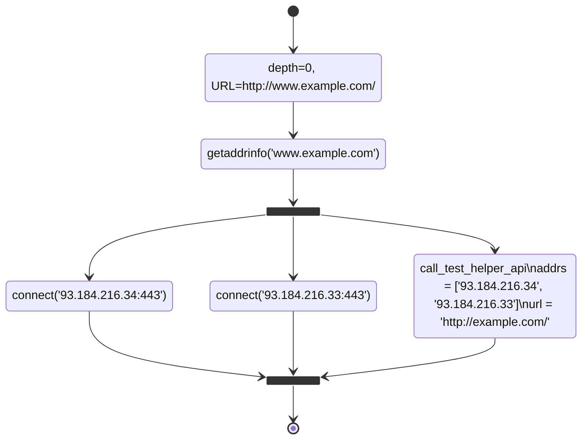
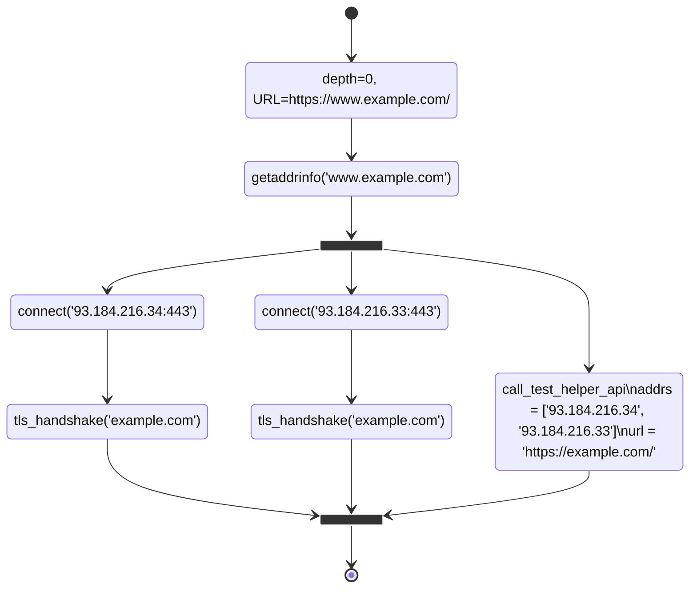
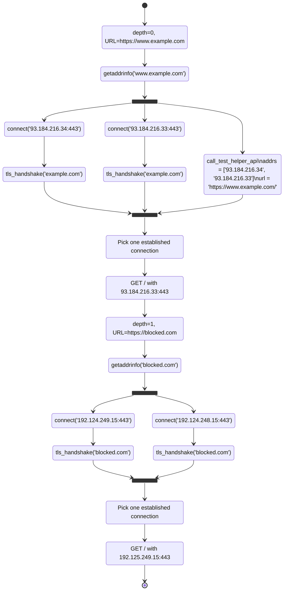

# Web Connectivity

## Specification version number

2024-02-14-001

* _status_: current

## Specification name

Web Connectivity (`web_connectivity`)

## Test preconditions

* An internet connection;

* The ability to reach the Web Connectivity test helper (TH).

## Expected impact

Ability to detect if the websites being tested are reachable and if not what are
some of the reasons for them not being reachable.

## Expected inputs

In OONI Probe CLI, you typically run Web Connectivity without any input as follows:

```bash
ooniprobe run websites
```

which is equivalent to running the corresponding "websites" group in the Android,
iOS, and Desktop OONI Probe applications.

When you run Web Connectivity like this, it connects to the OONI backend before the beginning
of the experiment and fetches the list of URLs to be tested. In such a case, you're getting
a list of URLs based on [the citizenlab/test-lists repository](https://github.com/citizenlab/test-lists)
that depend on your contry code, network, and URL prioritization algorithms.

It is also possible for you to manually specify which URLs to test from the command line:

```bash
ooniprobe run websites --input https://www.example.com/
```

It is also possible for you to create a file containing one line for each URL, e.g.:

```text
https://example.com/
https://example.it/path/
https://example.fr/a/longer/path/
https://example.org/
https://93.184.216.34/
https://[2606:2800:220:1:248:1893:25c8:1946]:443/
```

and run it as follows:

```bash
ooniprobe run websites --input-file FILE_NAME.txt
```

URLs may contain IP addresses rather than domain names. IPv6 addresses should be quoted using `[`
and `]` when there's a need to also specify a port (as illustrated above).

When using the `miniooni` research client, you run Web Connectivity as follows:

```bash
miniooni web_connectivity
```

You measure a specific URL as follows:

```bash
miniooni web_connectivity --input https://www.example.com/
```

You measure a list of URLs as follows:

```bash
miniooni web_connectivity --input-file INPUT_FILE.txt
```

## Test description

Since we first specified this test, its implementation has changed significantly
to improve our censorship detection capabilities. We will first describe the "classic"
algorithm implemented by Web Connectivity and then proceed to explain extensions
designed to collect additional information useful to characterize censorship. After
that, we specify how OONI Probe should process Web Connectivity results, to determine
whether the URL is accessible or there's blocking in place. (Note that the
OONI backend is better positioned to determine blocking and accessibility given that
it can cross compare measurements and apply fingerprints.)

### The classic algorithm

As a preliminary step, Web Connectivity performs an IPv4 resolver lookup step. We
query for `whoami.v4.powerdns.org` using the system resolver and we record the resolved
address in the `client_resolver` test key. Because modern OONI Probe implementations
perform this step by default for all experiments, modern implementations of
Web Connectivity read the `client_resolver` from the measurement session.

After that, there are two steps: the "connectivity" step and the "web" step.

#### The connectivity step

The objectives of this step are the following:

1. to discover IP addresses for the domain in the input URL using a specific
resolver (typically, the "system" resolver using `getaddrinfo` on Unix, so that we
end up using the DNS resolver configured on the system);

2. to query the Web Connectivity test helper (TH) providing to it the URL to
measure as well as the resolved IP addresses, such that we can have control
information to which to compare our measurement;

3. to establish TCP connections to all the endpoints constructed by appending
the scheme's port (`80` for `http` and `443` for `tcp`) or the custom port
specified in the URL;

4. optionally, to establish TLS connections to all these endpoints.

We call this step the "connectivity" step because it determines whether we're
able to establish TCP/TLS connections with the IP addresses associated with the domain
inside the URL. When the URL does not contain a domain but rather contains an
IP address, the first step of the algorithm just returns the IP address itself
and we're using the address to validate the TLS certificate.

The following diagram illustrates the set of operations performed by the
classic algorithm for `http://` like URLs:



The two small black squares in the diagram represent, respectively, starting several
operations in parallel and awaiting for these operations to complete. We set specific
timeouts for each parallel operation.

Instead, the following diagram illustrates what happens for `https://` like URLs:



When the `getaddrinfo` lookup fails, the algorithm still invokes the test helper
and passes an empty array of discovered IP addresses. Historically, Web Connectivity
does not use IP addresses returned by the test helper to measure connectivity, but
modern versions do that as an extension to the classic algorithm.

#### The web step

Web Connectivity constructs an HTTP client configured to honour cookies and to follow redirects,
and uses such a client to fetch the webpage associated with the input URL. Historically, Web
Connectivity does not reuse the connections established during the connectivity step to GET
the provided URL, but modern versions do that as an extension, to avoid the need
to re-establish new connections from scratch. We call this step the "web" step because
its goal is to fetch a webpage for the input URL.

#### Data collected by these steps

The connectivity step collects these information:

1. `df-002-dns.md` information (stored inside the `queries` test key) when
performing the DNS lookup. Note that, when the URL already contains an IP address,
Web Connectivity MAY fake a DNS lookup, however, this behavior is NOT RECOMMENDED
because it could possibly lead to confusion when looking at the data.

2. `df-005-tcpconnect.md` information (stored inside `tcp_connect`) and with
the `tcptls_handshake` tag set. This information pertains to all
the TCP connect operations performed during the connectivity step.

3. `df-006-tlshandshake.md` information (stored inside `tls_handshakes`)
and with the `tcptls_handshake` tag set. This information pertains
to all the TLS handshake operations performed during the connectivity step.

4. `df-008-netevents.md` information (stored inside `network_events`)
and with the `tcptls_handshake` tag set. This information pertains to all
the socket I/O operations performed during the TLS handshakes of the connectivity
step and could be used by the OONI backend to detect throttling.

The web step collects these information:

1. `df-001-http.md` information (stored inside the `requests` test key). This
information pertains to the HTTP requests performed during the web step and MUST
be sorted in time-reverse order. That is, in case of redirects, the last request
in the list is the 0-th redirect, the penultimate request is the 1-th redirect,
and so on, until we reach the final response.

If Web Connectivity uses extensions, data collected by the classic algorithm
MUST have the `classic` tag set, to distinguish it from ancillary data we
collect. Additionally, Web Connectivity SHOULD use the `depth=N` tag for
each collected event, to map each piece of collected data to the proper
redirect depth. Additionally, Web Connectivity SHOULD use the `transaction_id`
field defined by all the relevant data formats such that:

1. each DNS lookup (including the ones performed as part of extensions)
SHOULD be on its own `transaction_id`.

2. Each operation using the same TCP endpoint as part of the same redirect
depth SHOULD also be assigned its own `transaction_id`.  That is, a TCP
connect to, say, `1.2.3.4:443/tcp` SHOULD have the same `transaction_id` of
the corresponding TLS handshakes, network events, and requests.

When Web Connectivity performs additional measurements (e.g., extra TLS
handshakes to validate IP addresses), it SHOULD use the `fetch_body=bool`
tag such that:

1. all the operations whose objective is to _possibly_ fetch a response
body according to the classic algorithm have `fetch_body=true` (e.g., all
the TLS handshakes related to the input `https://` like URL);

2. all the other operations (e.g., the ones to verify whether IP
addresses are valid for the domain) have `fetch_body=false` (e.g., the
extra TLS handshakes performed when the URL is `http://` like).

Having discussed the main algorithm, let us now discuss extensions.

#### Extension E001: TLS-based IP address validation

When the input URL has the `http` scheme, Web Connectivity additionally
performs TLS handshakes with the corresponding `443/tcp` endpoints to
gather data useful to determine whether the resolved IP addresses are valid
for the domain. A successful TLS handhsake, in fact, tells us that the
resolved IP addresses are valid for the domain.

Web Connectivity MUST NOT perform these checks when the input URL is
`http://` and an explicit port has been specified.

#### Extension E002: Connectivity step for each redirect

Rather than using an HTTP client to fetch a webpage, Web Connectivity
follows this algorithm:

1. at the end of the connectivity step, choose one endpoint that
we could successfully establish a connection to and issue a GET request
using such an endpoint, collecting `df-001-http.md` data as well as
I/O data according to `df-008-netevents.md`;

2. parse the HTTP response and, in case of `302`, `303,` `307`, and `308`
redirects, prepare for measuring the URL included into the `Location` making
sure we also record and honour the cookies;

3. follow the redirect by performing a connectivity step for the
redirect URL, then perform the first step of this algorithm with one
of the connections that we could successfully establish except that
we do not issue a TH request in this case (motivation: the current TH
protocol cannot accommodate for that and we would create excessive
TH load if we did that);

4. stop with an error after ten redirects.

To illustrate the overall algorithm, the following diagram shows what it would do in
case we're measuring `https://www.example.com/` that redirects to `http://blocked.com`:



When using this algorithm, the implementation MUST correctly set the
`depth=N` tag. By using this algorithm, we get extra visibility of
what happens in the network while following redirects. Hence, we can
more precisely figure out the reason for blocking.

#### Extension E003: DNS-over-UDP lookups

Whenever it performs a DNS lookup, Web Connectivity runs a secondary
lookup using a DNS-over-UDP resolver using a well-known endpoint (e.g.,
`8.8.8.8:53`). Web Connectivity saves the results of this lookup inside the
`queries` test key. The results collected by this resolver MUST NOT set
the `classic` tag, given that this is an extension.

Web Connectivity SHOULD try to prioritize IP addresses resolved
by the system resolver but MAY use IP addresses used by this extra
resolver when the system resolver fails.

#### Extension E004: DNS-over-HTTPS lookups

Web Connectivity MAY run a lookup using a DNS-over-HTTPS resolver
such as `https://dns.google/dns-query`. Web Connectivity saves the
results of this lookup inside the `queries` test key. The results
collected by this resolver MUST NOT set the `classic` tag, given
that this is an extension.

When analyzing data, be careful that the results of this lookup
are not informative of DNS blocking of the input URL's domain, rather,
they show whether the given DNS-over-HTTPS endpoint is blocked.

In other words, this extension enables us to perform opportunistic
DNS-over-HTTPS measurements as part of Web Connectivity.

Web Connectivity SHOULD try to prioritize IP addresses resolved
by the system resolver but MAY use IP addresses used by this extra
resolver when the system resolver fails.

#### Extension E005: Using addresses resolved by the TH

The Web Connectivity test helper (TH) returns the results of
looking up the hostname inside the URL.

Web Connectivity SHOULD try to prioritize IP addresses resolved
by the TH but MAY use IP addresses used by this extra resolver when
the system resolver fails.

### Local processing of the measurement results

Web Connectivity measurement completes when one of the following happens:

1. we obtain a response that is not a redirect (the "final" response);

2. a network or protocol error prevents us from obtaining a final webpage (e.g., a
DNS, TCP, TLS, or HTTP failure);

3. we are redirected ten times.

At the end of the measurement, we have the following information:

1. "classic" DNS lookups for the domain in the input URL;

2. "classic" TCP connects and possibly TLS handshakes towards TCP endpoints constructed
using the URL scheme or an explicit port and IP addresses resolved by "classic" DNS lookups;

3. the result of each HTTP request that was attempted possibly including a final webpage;

4. results of DNS lookups, TCP connects, and TLS handshakes performed by the
test helper and directly comparable to the corresponding "classic" results;

5. the final response obtained by the test helper, if any;

6. possibly additional non-"classic" information obtained through extensions.

Based on this information, Web Connectivity needs to compute the following test keys:

| Name                | Type                     | Semantics                                                           |
| ------------------- | ------------------------ | ------------------------------------------------------------------- |
| `dns_consistency`   | `optional<string>`       | Consistency of probe and TH DNS lookups                             |
| `body_proportion`   | `optional<float64>`      | Proportion of probe and TH's final response body                    |
| `body_length_match` | `optional<bool>`         | Whether probe and TH's final response body are close enough in size |
| `headers_match`     | `optional<bool>`         | Whether probe and TH's final response are similar enough            |
| `status_code_match` | `optional<bool>`         | Whether probe and TH's final response status code are ~same         |
| `title_match`       | `optional<bool>`         | Whether probe and TH's final response title are ~same               |
| `blocking`          | `optional<string\|bool>` | Whether we think there's some blocking in place                     |
| `accessible`        | `optional<bool>`         | Whether the website seems accessible                                |

For historical reasons and backward compatibility, Web Connectivity MUST only use the
measurements collected by the classical algorithm to produce a measurement result. New
versions of Web Connectivity MAY produce additional measurement results but those results
MUST use different test keys than the one used by the classic algorithm.

Finally, note that this specification aims to describe the general idea behind the
algorithms, which may be more complex of this because they typically need to deal with
(a) avoiding false positives and (b) correctly flagging corner cases.

#### Preliminary definitions

Given a specific operation (e.g., a TLS handshake with a given TLS endpoint), we define:

* _Expected success_: when both the probe and the TH succeeded in performing the given operation.

* _Unexpected failure_: when the probe failed and the TH succeeded.

* _Expected failure_: when both the probe and the TH failed.

* _Unexpected success_: when the probe succeded and the TH failed.

* _Unexplained success_: when the probe succeeded and there is no related TH data.

* _Unexplained failure_: when the probe failed and there is no related TH data.

With these definitions, we can now discuss specific test keys.

#### dns_consistency

Broadly speaking, we set this field to `"consistent"` when the result of "classic" DNS lookups
match the DNS lookups performed by the TH. This include cases where we see expected
successes and failures as well as cases where the resolved addresses are compatible with
each other; i.e., the case when one of the following happens:

1. the probe and the TH resolved the same addresses;

2. the addresses resolved by the probe and the TH belong to the same ASNs;

3. (optionally) we did not see any bogon resolved exclusively by the probe;

4. (optionally) we concluded that some IP addresses are good because we could
successfully perform TLS handshakes for the domain we were using.

We set this field to `"inconsistent"` when we could not determine
consistency and we were able to resolve some IP addresses. We leave this field `null`
if we cannot determine either consistency or inconsistency of the results. Historically,
Web Connectivity also assigned the `"reverse_match"` value when there was a match
between the reverse lookup of addresses resolved by the probe and the TH, but current
versions do not implement this functionality at present.

#### body_proportion

This field is the minimum ratio between the final response body obtained by the probe
over the one obtained by the test helper and the inverse of such a ratio.

That is:

```Python
body_proportion = None
if probe.body_length > 0 and th.body_length > 0:
    ratio = probe.body_length / th.body_length
    inverse = th.body_length / probe.body_length
    body_proportion = min(ratio, inverse)
```

We use this value to compute the following test key. Obviously, we cannot compute
this value unless both the probe and the test helper obtained a final HTTP response.

#### body_length_match

We say that the two body lenghts match if their ratio is greater than 0.7:

```Python
if body_proportion is not None:
    body_length_match = body_proportion > 0.7
```

The underlying reason for saying that there is a match is that the two final
webpages should have similar lengths, otherwise it's possible that we've fetched
a blockpage with the probe.

#### headers_match

We set this value to `true` if the probe and the TH have seen similar uncommon
headers inside their final response. We set to `false` if there's a final response
but no uncommon headers. We leave this filed `null` otherwise.

We define uncommon headers the set of headers keys obtained by subtracting the
set of header keys in a final response and the set of headers commonly observed
inside HTTP responses.

#### status_code_match

We set this value to `true` if the final responses have the same status
code and the TH's status code is `2xx`. We set this value to `false` if
the two status codes are different and the TH's status code is `2xx`. We
leave this field `null` otherwise.

#### title_match

We take the probe's final response title and the TH's final response title
and, for each of them, only keep words longer than 4 characters, which is the
average word length in English. If the two sets are not empty, we set the
`title_match` to whether they have at least one word in common. Otherwise, we
leave this field `null`.

#### blocking

By default, this field's value is `null`. We set the value to `false` if
we're able to get a final response and this final response matches the one
obtained by the test helper (more on this below). In case we cannot get a
final response, we set this value to one of the following:

* `"dns"`, if it seems the reason why we cannot obtain a final response
is DNS interference (e.g., injection of invalid IP addresses);

* `"tcp_ip"`, if it seems the reason why we cannot obtain a final
response is TCP/IP blocking of the server's IP addresses;

* `"http-failure"`, if it seems the reason why we cannot obtain a final
response is TLS or HTTP blocking (this is for historical reasons, as the
original Web Connectivity implementation did not specify what to use
in case of TLS interference).

When we have a final response, and the scheme of the corresponding
request is `https`, we always set this field to `false`.

Otherwise, we run the following "HTTP diff" algorithm to determine
the value of the `blocking` test key:

```Python
if status_code_match is not None and status_code_match:

    if body_length_match is not None and body_length_match:
        blocking = False
        return

    if headers_match is not None and headers_match:
        blocking = False
        return

    if title_match is not None and title_match:
        blocking = False
        return

blocking = "http-diff"
```

#### accessible

This value is `true` if we think we obtained a legitimate final response, `false`
if we could not, and `null` if we could not determine whether there was a legitimate
final response.

#### Notable blocking and accessible combinations

The following table summarizes some common blocking and accessible combinations:

| blocking         | accessible | what we think is happening                 |
| ---------------- | ---------- | ------------------------------------------ |
| `null`           | `null`     | We could not assign values to the fields   |
| `false`          | `false`    | Expected failures (e.g., the website down) |
| `false`          | `true`     | Expected success (i.e., no censorship)     |
| `"dns"`          | `false`    | DNS-based blocking                         |
| `"tcp_ip"`       | `false`    | TCP-based blocking                         |
| `"http-failure"` | `false`    | HTTP or TLS based blocking                 |
| `"http-diff"`    | `false`    | Blockpage rather than legit page           |

Obviously, false positives may happen. Additionally, note that it is possible for
a website to be blocked in multiple ways. For example, there may be DNS blocking but
Web Connectivity could obtain and use IP addresses from the test helper, only to
discover that there's TLS or TCP based blocking. A future version of this specification
will describe additional test keys aimed at providing a more fine grained
characterization of blocking.

## Expected output

### Parent data format

We will include data following these data formats.

* `df-001-httpt`
* `df-002-dnst`
* `df-005-tcpconnect`
* `df-006-tlshandshake`
* `df-008-netevents`

We already described below how this data formats will be used. Historically, Web
Connectivity included a `"blocked"` key to each `tcp_connect` entry but modern versions
of this experiment do not do that anymore.

### Semantics

The following specification summarizes the top-level test keys:

```text
{
    "client_resolver": "1.2.3.4",
    "dns_consistency": "consistent" | "reverse_match" | "inconsistent",
    "body_length_match": true | false | null,
    "headers_match": true | false | null,
    "status_code_match": true | false | null,
    "title_match": true | false | null,
    "accessible": true | false | null,
    "blocking": "tcp_ip" | "dns" | "http-diff" | "http-failure" | false | null
}
```

We already discussed each of these fields in the above sections.

### Possible conclusions

* If the URL in question is accessible from the network vantage point of the probe.

* If the main mechanism of blocking of the URL in question is being performed by means
of DNS tampering, TCP blocking, HTTP or TLS interference, or transparent proxying.

## Limitations

Web Connectivity does not correctly handle server-side blocking with `https://` like URLs, as
documented by [ooni/probe#2661](https://github.com/ooni/probe/issues/2661). This happens because,
as explained above, we automatically set `"blocking"` to `false` when the request uses `https`.

## Privacy considerations

If the client has opted out of providing the ASN of their probe the
client_resolver key may give away extra information pertaining to the network
they are on if they are using the resolver of their ISP. (Modern probes do
not allow users to opt-out of providing their ANSs because that would
lead to non-actionable measurements. It can still occurr that the ASN is
set to zero if the ANS resolution mechanism failed.)

## Examples

### Example control request and response

Request:

```JSON
{
  "http_request": "https://www.example.com/",
  "http_request_headers": {
    "Accept": [
      "text/html,application/xhtml+xml,application/xml;q=0.9,*/*;q=0.8"
    ],
    "Accept-Language": [
      "en-US,en;q=0.9"
    ],
    "User-Agent": [
      "Mozilla/5.0 (Windows NT 10.0; Win64; x64) AppleWebKit/537.36 (KHTML, like Gecko) Chrome/119.0.0.0 Safari/537.3"
    ]
  },
  "tcp_connect": [
    "93.184.216.34:443",
    "[2606:2800:220:1:248:1893:25c8:1946]:443"
  ],
  "x_quic_enabled": false
}
```

Response:

```JSON
{
    "tcp_connect": {
        "93.184.216.34:443": {
            "status": true,
            "failure": null
        },
        "[2606:2800:220:1:248:1893:25c8:1946]:443": {
            "status": true,
            "failure": null
        }
    },
    "tls_handshake": {
        "93.184.216.34:443": {
            "server_name": "www.example.com",
            "status": true,
            "failure": null
        },
        "[2606:2800:220:1:248:1893:25c8:1946]:443": {
            "server_name": "www.example.com",
            "status": true,
            "failure": null
        }
    },
    "quic_handshake": {},
    "http_request": {
        "body_length": 1256,
        "discovered_h3_endpoint": "",
        "failure": null,
        "title": "Example Domain",
        "headers": {
            "Age": "427098",
            "Cache-Control": "max-age=604800",
            "Content-Length": "1256",
            "Content-Type": "text/html; charset=UTF-8",
            "Date": "Wed, 14 Feb 2024 09:04:33 GMT",
            "Etag": "\"3147526947+ident\"",
            "Expires": "Wed, 21 Feb 2024 09:04:33 GMT",
            "Last-Modified": "Thu, 17 Oct 2019 07:18:26 GMT",
            "Server": "ECS (dce/268A)",
            "Vary": "Accept-Encoding",
            "X-Cache": "HIT"
        },
        "status_code": 200
    },
    "http3_request": null,
    "dns": {
        "failure": null,
        "addrs": [
            "93.184.216.34",
            "2606:2800:220:1:248:1893:25c8:1946"
        ]
    },
    "ip_info": {
        "2606:2800:220:1:248:1893:25c8:1946": {
            "asn": 15133,
            "flags": 11
        },
        "93.184.216.34": {
            "asn": 15133,
            "flags": 11
        }
    }
}
```

*Note*: the control will set `body_length` and `status_code` to `-1` in
case of failure. The client code must correctly handle this case.

### Example output sample

```JSON
{
  "annotations": {
    "architecture": "arm64",
    "engine_name": "ooniprobe-engine",
    "engine_version": "3.21.0-alpha",
    "go_version": "go1.20.12",
    "platform": "macos",
    "vcs_modified": "false",
    "vcs_revision": "b36dd8f78265762d5ef214a4ff72e2d856410e11",
    "vcs_time": "2024-02-13T02:52:13Z",
    "vcs_tool": "git"
  },
  "data_format_version": "0.2.0",
  "extensions": {
    "dnst": 0,
    "httpt": 0,
    "netevents": 0,
    "tcpconnect": 0,
    "tlshandshake": 0,
    "tunnel": 0
  },
  "input": "https://www.example.com/",
  "measurement_start_time": "2024-02-14 09:06:17",
  "probe_asn": "AS30722",
  "probe_cc": "IT",
  "probe_ip": "127.0.0.1",
  "probe_network_name": "Vodafone Italia S.p.A.",
  "report_id": "20240214T090617Z_webconnectivity_IT_30722_n1_1IvUiXNWHooB5rmD",
  "resolver_asn": "AS13335",
  "resolver_ip": "162.158.131.11",
  "resolver_network_name": "Cloudflare Inc",
  "software_name": "miniooni",
  "software_version": "3.21.0-alpha",
  "test_helpers": {
    "backend": {
      "address": "https://2.th.ooni.org",
      "type": "https"
    }
  },
  "test_keys": {
    "agent": "redirect",
    "client_resolver": "162.158.131.11",
    "retries": null,
    "socksproxy": null,
    "network_events": [
      {
        "address": "[2606:2800:220:1:248:1893:25c8:1946]:443",
        "failure": "host_unreachable",
        "operation": "connect",
        "proto": "tcp",
        "t0": 0.390815,
        "t": 0.391203,
        "transaction_id": 50002,
        "tags": [
          "classic",
          "tcptls_experiment",
          "depth=0",
          "fetch_body=true"
        ]
      },
      {
        "address": "93.184.216.34:443",
        "failure": null,
        "operation": "connect",
        "proto": "tcp",
        "t0": 0.390724,
        "t": 0.549308,
        "transaction_id": 50001,
        "tags": [
          "classic",
          "tcptls_experiment",
          "depth=0",
          "fetch_body=true"
        ]
      },
      {
        "address": "93.184.216.34:443",
        "failure": null,
        "operation": "tls_handshake_start",
        "proto": "tcp",
        "t0": 0.549373,
        "t": 0.549373,
        "transaction_id": 50001,
        "tags": [
          "classic",
          "tcptls_experiment",
          "depth=0",
          "fetch_body=true"
        ]
      },
      {
        "address": "93.184.216.34:443",
        "failure": null,
        "num_bytes": 281,
        "operation": "write",
        "proto": "tcp",
        "t0": 0.549704,
        "t": 0.549768,
        "transaction_id": 50001,
        "tags": [
          "classic",
          "tcptls_experiment",
          "depth=0",
          "fetch_body=true"
        ]
      },
      {
        "address": "93.184.216.34:443",
        "failure": null,
        "num_bytes": 99,
        "operation": "read",
        "proto": "tcp",
        "t0": 0.54978,
        "t": 0.677575,
        "transaction_id": 50001,
        "tags": [
          "classic",
          "tcptls_experiment",
          "depth=0",
          "fetch_body=true"
        ]
      },
      {
        "address": "93.184.216.34:443",
        "failure": null,
        "num_bytes": 6,
        "operation": "write",
        "proto": "tcp",
        "t0": 0.677603,
        "t": 0.677643,
        "transaction_id": 50001,
        "tags": [
          "classic",
          "tcptls_experiment",
          "depth=0",
          "fetch_body=true"
        ]
      },
      {
        "address": "93.184.216.34:443",
        "failure": null,
        "num_bytes": 314,
        "operation": "write",
        "proto": "tcp",
        "t0": 0.677767,
        "t": 0.677803,
        "transaction_id": 50001,
        "tags": [
          "classic",
          "tcptls_experiment",
          "depth=0",
          "fetch_body=true"
        ]
      },
      {
        "address": "93.184.216.34:443",
        "failure": null,
        "num_bytes": 576,
        "operation": "read",
        "proto": "tcp",
        "t0": 0.677857,
        "t": 0.808512,
        "transaction_id": 50001,
        "tags": [
          "classic",
          "tcptls_experiment",
          "depth=0",
          "fetch_body=true"
        ]
      },
      {
        "address": "93.184.216.34:443",
        "failure": null,
        "num_bytes": 812,
        "operation": "read",
        "proto": "tcp",
        "t0": 0.808985,
        "t": 0.808999,
        "transaction_id": 50001,
        "tags": [
          "classic",
          "tcptls_experiment",
          "depth=0",
          "fetch_body=true"
        ]
      },
      {
        "address": "93.184.216.34:443",
        "failure": null,
        "num_bytes": 2822,
        "operation": "read",
        "proto": "tcp",
        "t0": 0.809004,
        "t": 0.812455,
        "transaction_id": 50001,
        "tags": [
          "classic",
          "tcptls_experiment",
          "depth=0",
          "fetch_body=true"
        ]
      },
      {
        "address": "93.184.216.34:443",
        "failure": null,
        "num_bytes": 74,
        "operation": "write",
        "proto": "tcp",
        "t0": 0.815494,
        "t": 0.815545,
        "transaction_id": 50001,
        "tags": [
          "classic",
          "tcptls_experiment",
          "depth=0",
          "fetch_body=true"
        ]
      },
      {
        "address": "93.184.216.34:443",
        "failure": null,
        "operation": "tls_handshake_done",
        "proto": "tcp",
        "t0": 0.815575,
        "t": 0.815575,
        "transaction_id": 50001,
        "tags": [
          "classic",
          "tcptls_experiment",
          "depth=0",
          "fetch_body=true"
        ]
      },
      {
        "address": "93.184.216.34:443",
        "failure": null,
        "operation": "http_transaction_start",
        "proto": "tcp",
        "t0": 0.815758,
        "t": 0.815758,
        "transaction_id": 50001,
        "tags": [
          "classic",
          "tcptls_experiment",
          "depth=0",
          "fetch_body=true"
        ]
      },
      {
        "address": "93.184.216.34:443",
        "failure": null,
        "num_bytes": 86,
        "operation": "write",
        "proto": "tcp",
        "t0": 0.815893,
        "t": 0.815922,
        "transaction_id": 50001,
        "tags": [
          "classic",
          "tcptls_experiment",
          "depth=0",
          "fetch_body=true"
        ]
      },
      {
        "address": "93.184.216.34:443",
        "failure": null,
        "num_bytes": 198,
        "operation": "write",
        "proto": "tcp",
        "t0": 0.815994,
        "t": 0.816017,
        "transaction_id": 50001,
        "tags": [
          "classic",
          "tcptls_experiment",
          "depth=0",
          "fetch_body=true"
        ]
      },
      {
        "address": "93.184.216.34:443",
        "failure": null,
        "num_bytes": 510,
        "operation": "read",
        "proto": "tcp",
        "t0": 0.815999,
        "t": 0.935572,
        "transaction_id": 50001,
        "tags": [
          "classic",
          "tcptls_experiment",
          "depth=0",
          "fetch_body=true"
        ]
      },
      {
        "address": "93.184.216.34:443",
        "failure": null,
        "num_bytes": 127,
        "operation": "read",
        "proto": "tcp",
        "t0": 0.935645,
        "t": 0.939723,
        "transaction_id": 50001,
        "tags": [
          "classic",
          "tcptls_experiment",
          "depth=0",
          "fetch_body=true"
        ]
      },
      {
        "address": "93.184.216.34:443",
        "failure": null,
        "num_bytes": 31,
        "operation": "write",
        "proto": "tcp",
        "t0": 0.93976,
        "t": 0.939823,
        "transaction_id": 50001,
        "tags": [
          "classic",
          "tcptls_experiment",
          "depth=0",
          "fetch_body=true"
        ]
      },
      {
        "address": "93.184.216.34:443",
        "failure": null,
        "num_bytes": 1515,
        "operation": "read",
        "proto": "tcp",
        "t0": 0.939843,
        "t": 0.939852,
        "transaction_id": 50001,
        "tags": [
          "classic",
          "tcptls_experiment",
          "depth=0",
          "fetch_body=true"
        ]
      },
      {
        "address": "93.184.216.34:443",
        "failure": null,
        "operation": "http_transaction_done",
        "proto": "tcp",
        "t0": 0.940186,
        "t": 0.940186,
        "transaction_id": 50001,
        "tags": [
          "classic",
          "tcptls_experiment",
          "depth=0",
          "fetch_body=true"
        ]
      },
      {
        "address": "93.184.216.34:443",
        "failure": null,
        "num_bytes": 24,
        "operation": "write",
        "proto": "tcp",
        "t0": 0.940384,
        "t": 0.940422,
        "transaction_id": 50001,
        "tags": [
          "classic",
          "tcptls_experiment",
          "depth=0",
          "fetch_body=true"
        ]
      },
      {
        "address": "93.184.216.34:443",
        "failure": "connection_already_closed",
        "operation": "read",
        "proto": "tcp",
        "t0": 0.94001,
        "t": 0.940512,
        "transaction_id": 50001,
        "tags": [
          "classic",
          "tcptls_experiment",
          "depth=0",
          "fetch_body=true"
        ]
      },
      {
        "address": "93.184.216.34:443",
        "failure": null,
        "num_bytes": 6461,
        "operation": "bytes_received_cumulative",
        "proto": "tcp",
        "t0": 0.94056,
        "t": 0.94056,
        "transaction_id": 50001,
        "tags": [
          "classic",
          "tcptls_experiment",
          "depth=0",
          "fetch_body=true"
        ]
      }
    ],
    "x_dns_whoami": {
      "system_v4": [
        {
          "address": "162.158.131.11"
        }
      ],
      "udp_v4": {
        "1.1.1.1:53": [
          {
            "address": "162.158.131.143"
          }
        ]
      }
    },
    "x_doh": {
      "network_events": [
        {
          "failure": null,
          "operation": "resolve_start",
          "t0": 0.000888,
          "t": 0.000888,
          "transaction_id": 30001,
          "tags": [
            "depth=0"
          ]
        },
        {
          "address": "149.112.112.112:443",
          "failure": null,
          "operation": "connect",
          "proto": "tcp",
          "t0": 0.064547,
          "t": 0.122804,
          "transaction_id": 30001,
          "tags": [
            "depth=0"
          ]
        },
        {
          "address": "149.112.112.112:443",
          "failure": null,
          "operation": "tls_handshake_start",
          "proto": "tcp",
          "t0": 0.122879,
          "t": 0.122879,
          "transaction_id": 30001,
          "tags": [
            "depth=0"
          ]
        },
        {
          "address": "149.112.112.112:443",
          "failure": null,
          "num_bytes": 279,
          "operation": "write",
          "proto": "tcp",
          "t0": 0.123299,
          "t": 0.123359,
          "transaction_id": 30001,
          "tags": [
            "depth=0"
          ]
        },
        {
          "address": "149.112.112.112:443",
          "failure": null,
          "num_bytes": 576,
          "operation": "read",
          "proto": "tcp",
          "t0": 0.123373,
          "t": 0.195812,
          "transaction_id": 30001,
          "tags": [
            "depth=0"
          ]
        },
        {
          "address": "149.112.112.112:443",
          "failure": null,
          "num_bytes": 812,
          "operation": "read",
          "proto": "tcp",
          "t0": 0.196251,
          "t": 0.196262,
          "transaction_id": 30001,
          "tags": [
            "depth=0"
          ]
        },
        {
          "address": "149.112.112.112:443",
          "failure": null,
          "num_bytes": 2113,
          "operation": "read",
          "proto": "tcp",
          "t0": 0.196266,
          "t": 0.199866,
          "transaction_id": 30001,
          "tags": [
            "depth=0"
          ]
        },
        {
          "address": "149.112.112.112:443",
          "failure": null,
          "num_bytes": 80,
          "operation": "write",
          "proto": "tcp",
          "t0": 0.204227,
          "t": 0.204276,
          "transaction_id": 30001,
          "tags": [
            "depth=0"
          ]
        },
        {
          "address": "149.112.112.112:443",
          "failure": null,
          "operation": "tls_handshake_done",
          "proto": "tcp",
          "t0": 0.204297,
          "t": 0.204297,
          "transaction_id": 30001,
          "tags": [
            "depth=0"
          ]
        },
        {
          "address": "149.112.112.112:443",
          "failure": null,
          "num_bytes": 86,
          "operation": "write",
          "proto": "tcp",
          "t0": 0.204393,
          "t": 0.204422,
          "transaction_id": 30001,
          "tags": [
            "depth=0"
          ]
        },
        {
          "address": "149.112.112.112:443",
          "failure": null,
          "num_bytes": 163,
          "operation": "write",
          "proto": "tcp",
          "t0": 0.204528,
          "t": 0.204556,
          "transaction_id": 30001,
          "tags": [
            "depth=0"
          ]
        },
        {
          "address": "149.112.112.112:443",
          "failure": null,
          "num_bytes": 159,
          "operation": "write",
          "proto": "tcp",
          "t0": 0.20457,
          "t": 0.204594,
          "transaction_id": 30001,
          "tags": [
            "depth=0"
          ]
        },
        {
          "address": "149.112.112.112:443",
          "failure": null,
          "num_bytes": 38,
          "operation": "write",
          "proto": "tcp",
          "t0": 0.204614,
          "t": 0.204643,
          "transaction_id": 30001,
          "tags": [
            "depth=0"
          ]
        },
        {
          "address": "149.112.112.112:443",
          "failure": null,
          "num_bytes": 159,
          "operation": "write",
          "proto": "tcp",
          "t0": 0.204649,
          "t": 0.204676,
          "transaction_id": 30001,
          "tags": [
            "depth=0"
          ]
        },
        {
          "address": "149.112.112.112:443",
          "failure": null,
          "num_bytes": 542,
          "operation": "read",
          "proto": "tcp",
          "t0": 0.204477,
          "t": 0.24641,
          "transaction_id": 30001,
          "tags": [
            "depth=0"
          ]
        },
        {
          "address": "149.112.112.112:443",
          "failure": null,
          "num_bytes": 52,
          "operation": "read",
          "proto": "tcp",
          "t0": 0.246431,
          "t": 0.247916,
          "transaction_id": 30001,
          "tags": [
            "depth=0"
          ]
        },
        {
          "address": "149.112.112.112:443",
          "failure": null,
          "num_bytes": 31,
          "operation": "write",
          "proto": "tcp",
          "t0": 0.247935,
          "t": 0.247979,
          "transaction_id": 30001,
          "tags": [
            "depth=0"
          ]
        },
        {
          "address": "149.112.112.112:443",
          "failure": null,
          "num_bytes": 554,
          "operation": "read",
          "proto": "tcp",
          "t0": 0.247989,
          "t": 0.255268,
          "transaction_id": 30001,
          "tags": [
            "depth=0"
          ]
        },
        {
          "failure": null,
          "operation": "resolve_done",
          "t0": 0.255556,
          "t": 0.255556,
          "transaction_id": 30001,
          "tags": [
            "depth=0"
          ]
        },
        {
          "address": "149.112.112.112:443",
          "failure": null,
          "num_bytes": 24,
          "operation": "write",
          "proto": "tcp",
          "t0": 0.255584,
          "t": 0.255624,
          "transaction_id": 30001,
          "tags": [
            "depth=0"
          ]
        },
        {
          "address": "149.112.112.112:443",
          "failure": "connection_already_closed",
          "operation": "read",
          "proto": "tcp",
          "t0": 0.255378,
          "t": 0.255716,
          "transaction_id": 30001,
          "tags": [
            "depth=0"
          ]
        }
      ],
      "queries": [
        {
          "answers": [
            {
              "asn": 19281,
              "as_org_name": "Quad9",
              "answer_type": "A",
              "ipv4": "149.112.112.112",
              "ttl": null
            },
            {
              "asn": 19281,
              "as_org_name": "Quad9",
              "answer_type": "A",
              "ipv4": "9.9.9.9",
              "ttl": null
            },
            {
              "asn": 19281,
              "as_org_name": "Quad9",
              "answer_type": "AAAA",
              "ipv6": "2620:fe::fe",
              "ttl": null
            },
            {
              "asn": 19281,
              "as_org_name": "Quad9",
              "answer_type": "AAAA",
              "ipv6": "2620:fe::9",
              "ttl": null
            },
            {
              "answer_type": "CNAME",
              "hostname": "dns.quad9.net.",
              "ttl": null
            }
          ],
          "engine": "getaddrinfo",
          "failure": null,
          "hostname": "dns.quad9.net",
          "query_type": "ANY",
          "resolver_hostname": null,
          "resolver_port": null,
          "resolver_address": "",
          "t0": 0.001064,
          "t": 0.063724,
          "tags": [
            "depth=0"
          ],
          "transaction_id": 30001
        }
      ],
      "requests": [],
      "tcp_connect": [
        {
          "ip": "149.112.112.112",
          "port": 443,
          "status": {
            "failure": null,
            "success": true
          },
          "t0": 0.064547,
          "t": 0.122804,
          "tags": [
            "depth=0"
          ],
          "transaction_id": 30001
        }
      ],
      "tls_handshakes": [
        {
          "network": "tcp",
          "address": "149.112.112.112:443",
          "cipher_suite": "TLS_AES_256_GCM_SHA384",
          "failure": null,
          "negotiated_protocol": "h2",
          "no_tls_verify": false,
          "peer_certificates": [
            {
              "data": "MIIGyDCCBk6gAwIBAgIQDQsh8YVJ+5rl2I/Z0i4MlzAKBggqhkjOPQQDAzBWMQswCQYDVQQGEwJVUzEVMBMGA1UEChMMRGlnaUNlcnQgSW5jMTAwLgYDVQQDEydEaWdpQ2VydCBUTFMgSHlicmlkIEVDQyBTSEEzODQgMjAyMCBDQTEwHhcNMjMwNzMxMDAwMDAwWhcNMjQwODA2MjM1OTU5WjBbMQswCQYDVQQGEwJVUzETMBEGA1UECBMKQ2FsaWZvcm5pYTERMA8GA1UEBxMIQmVya2VsZXkxDjAMBgNVBAoTBVF1YWQ5MRQwEgYDVQQDDAsqLnF1YWQ5Lm5ldDBZMBMGByqGSM49AgEGCCqGSM49AwEHA0IABH2L1x0DhQ0YJbM0HCmhJ9SsASVIiqDx6gK52FEsCGqsclbs+j2moJ9JCVWOrP65cxdcAvt4zCSRlG9DI4kOHWajggT3MIIE8zAfBgNVHSMEGDAWgBQKvAgpF4ylOW16Ds4zxy6z7fvDejAdBgNVHQ4EFgQUf6kSpdfGi0gCxz0qRW5AHkBg9JcwggGNBgNVHREEggGEMIIBgIILKi5xdWFkOS5uZXSCCXF1YWQ5Lm5ldIcECQkJCYcECQkJCocECQkJC4cECQkJDIcECQkJDYcECQkJDocECQkJD4cElXBwCYcElXBwCocElXBwC4cElXBwDIcElXBwDYcElXBwDocElXBwD4cElXBwcIcQJiAA/gAAAAAAAAAAAAAACYcQJiAA/gAAAAAAAAAAAAAAEIcQJiAA/gAAAAAAAAAAAAAAEYcQJiAA/gAAAAAAAAAAAAAAEocQJiAA/gAAAAAAAAAAAAAAE4cQJiAA/gAAAAAAAAAAAAAAFIcQJiAA/gAAAAAAAAAAAAAAFYcQJiAA/gAAAAAAAAAAAAAA/ocQJiAA/gAAAAAAAAAAAP4ACYcQJiAA/gAAAAAAAAAAAP4AEIcQJiAA/gAAAAAAAAAAAP4AEYcQJiAA/gAAAAAAAAAAAP4AEocQJiAA/gAAAAAAAAAAAP4AE4cQJiAA/gAAAAAAAAAAAP4AFIcQJiAA/gAAAAAAAAAAAP4AFTAOBgNVHQ8BAf8EBAMCB4AwHQYDVR0lBBYwFAYIKwYBBQUHAwEGCCsGAQUFBwMCMIGbBgNVHR8EgZMwgZAwRqBEoEKGQGh0dHA6Ly9jcmwzLmRpZ2ljZXJ0LmNvbS9EaWdpQ2VydFRMU0h5YnJpZEVDQ1NIQTM4NDIwMjBDQTEtMS5jcmwwRqBEoEKGQGh0dHA6Ly9jcmw0LmRpZ2ljZXJ0LmNvbS9EaWdpQ2VydFRMU0h5YnJpZEVDQ1NIQTM4NDIwMjBDQTEtMS5jcmwwPgYDVR0gBDcwNTAzBgZngQwBAgIwKTAnBggrBgEFBQcCARYbaHR0cDovL3d3dy5kaWdpY2VydC5jb20vQ1BTMIGFBggrBgEFBQcBAQR5MHcwJAYIKwYBBQUHMAGGGGh0dHA6Ly9vY3NwLmRpZ2ljZXJ0LmNvbTBPBggrBgEFBQcwAoZDaHR0cDovL2NhY2VydHMuZGlnaWNlcnQuY29tL0RpZ2lDZXJ0VExTSHlicmlkRUNDU0hBMzg0MjAyMENBMS0xLmNydDAJBgNVHRMEAjAAMIIBfgYKKwYBBAHWeQIEAgSCAW4EggFqAWgAdgDuzdBk1dsazsVct520zROiModGfLzs3sNRSFlGcR+1mwAAAYmtrLxjAAAEAwBHMEUCIQCAWtmgTRnZsqjxZ7jdiDq0EEfxBB4kMj7oaZPv+URihQIgUJxBXliHw3ic/24+0NilFj/WfEcV1kNRARUhXS6xn08AdwBIsONr2qZHNA/lagL6nTDrHFIBy1bdLIHZu7+rOdiEcwAAAYmtrLxLAAAEAwBIMEYCIQClQbGksPNEGkRsO930WOdpYDBhFWVD44nw9ks9uyawJAIhAPypE9SPFDDkOgrOw+K++guz486lzdjaAfVzdyO6sw80AHUA2ra/az+1tiKfm8K7XGvocJFxbLtRhIU0vaQ9MEjX+6sAAAGJray8FwAABAMARjBEAiBMmvofeflmsV3JoyFVid5GiJaPHkH9fDWkS93eP9fgEQIgfkTwCbSFNKnF47riYP4MJow7haBO+pFwRW5WAEC1AQQwCgYIKoZIzj0EAwMDaAAwZQIwOOsRrmNqg61CQTVH/6I6W1ZKb+5efJZpgZLVhCirpay7lyiuNyC1QkF6jfTAh+nGAjEAoRSNqC4pY/1GUJ3ygEjSOkUKlFnpXSxYIxJz9yJ43z05faF/uL+mrpAV9GXi2cpt",
              "format": "base64"
            },
            {
              "data": "MIIEFzCCAv+gAwIBAgIQB/LzXIeod6967+lHmTUlvTANBgkqhkiG9w0BAQwFADBhMQswCQYDVQQGEwJVUzEVMBMGA1UEChMMRGlnaUNlcnQgSW5jMRkwFwYDVQQLExB3d3cuZGlnaWNlcnQuY29tMSAwHgYDVQQDExdEaWdpQ2VydCBHbG9iYWwgUm9vdCBDQTAeFw0yMTA0MTQwMDAwMDBaFw0zMTA0MTMyMzU5NTlaMFYxCzAJBgNVBAYTAlVTMRUwEwYDVQQKEwxEaWdpQ2VydCBJbmMxMDAuBgNVBAMTJ0RpZ2lDZXJ0IFRMUyBIeWJyaWQgRUNDIFNIQTM4NCAyMDIwIENBMTB2MBAGByqGSM49AgEGBSuBBAAiA2IABMEbxppbmNmkKaDp1AS12+umsmxVwP/tmMZJLwYnUcu/cMEFesOxnYeJuq20ExfJqLSDyLiQ0cx0NTY8g3KwtdD3ImnI8YDEe0CPz2iHJlw5ifFNkU3aiYvkA8ND5b8vc6OCAYIwggF+MBIGA1UdEwEB/wQIMAYBAf8CAQAwHQYDVR0OBBYEFAq8CCkXjKU5bXoOzjPHLrPt+8N6MB8GA1UdIwQYMBaAFAPeUDVW0Uy7ZvCj4hsbw5eyPdFVMA4GA1UdDwEB/wQEAwIBhjAdBgNVHSUEFjAUBggrBgEFBQcDAQYIKwYBBQUHAwIwdgYIKwYBBQUHAQEEajBoMCQGCCsGAQUFBzABhhhodHRwOi8vb2NzcC5kaWdpY2VydC5jb20wQAYIKwYBBQUHMAKGNGh0dHA6Ly9jYWNlcnRzLmRpZ2ljZXJ0LmNvbS9EaWdpQ2VydEdsb2JhbFJvb3RDQS5jcnQwQgYDVR0fBDswOTA3oDWgM4YxaHR0cDovL2NybDMuZGlnaWNlcnQuY29tL0RpZ2lDZXJ0R2xvYmFsUm9vdENBLmNybDA9BgNVHSAENjA0MAsGCWCGSAGG/WwCATAHBgVngQwBATAIBgZngQwBAgEwCAYGZ4EMAQICMAgGBmeBDAECAzANBgkqhkiG9w0BAQwFAAOCAQEAR1mBf9QbH7Bx9phdGLqYR5iwfnYr6v8ai6wms0KNMeZK6BnQ79oU59cUkqGS8qcuLa/7Hfb7U7CKP/zYFgrpsC62pQsYkDUmotr2qLcy/JUjS8ZFucTP5Hzu5sn4kL1y45nDHQsFfGqXbbKrAjbYwrwsAZI/BKOLdRHHuSm8EdCGupK8JvllyDfNJvaGEwwEqonleLHBTnm8dqMLUeTF0J5q/hosVq4GNiejcxwIfZMy0MJEGdqN9A57HSgDKwmKdsp33Id6rHtSJlWncg+d0ohP/rEhxRqhqjn1VtvChMQ1H3Dau0bwhr9kAMQ+959GG50jBbl9s08PqUU643QwmA==",
              "format": "base64"
            }
          ],
          "server_name": "dns.quad9.net",
          "t0": 0.122879,
          "t": 0.204297,
          "tags": [
            "depth=0"
          ],
          "tls_version": "TLSv1.3",
          "transaction_id": 30001
        }
      ]
    },
    "x_do53": {
      "network_events": [
        {
          "failure": null,
          "operation": "resolve_start",
          "t0": 0.000472,
          "t": 0.000472,
          "transaction_id": 20001,
          "tags": [
            "depth=0"
          ]
        },
        {
          "address": "1.1.1.1:53",
          "failure": null,
          "num_bytes": 33,
          "operation": "write",
          "proto": "udp",
          "t0": 0.000699,
          "t": 0.000741,
          "transaction_id": 20001,
          "tags": [
            "depth=0"
          ]
        },
        {
          "address": "1.1.1.1:53",
          "failure": null,
          "num_bytes": 33,
          "operation": "write",
          "proto": "udp",
          "t0": 0.001085,
          "t": 0.001112,
          "transaction_id": 20001,
          "tags": [
            "depth=0"
          ]
        },
        {
          "address": "1.1.1.1:53",
          "failure": null,
          "num_bytes": 49,
          "operation": "read",
          "proto": "udp",
          "t0": 0.001121,
          "t": 0.038824,
          "transaction_id": 20001,
          "tags": [
            "depth=0"
          ]
        },
        {
          "address": "1.1.1.1:53",
          "failure": null,
          "num_bytes": 61,
          "operation": "read",
          "proto": "udp",
          "t0": 0.000954,
          "t": 0.045381,
          "transaction_id": 20001,
          "tags": [
            "depth=0"
          ]
        },
        {
          "failure": null,
          "operation": "resolve_done",
          "t0": 0.045739,
          "t": 0.045739,
          "transaction_id": 20001,
          "tags": [
            "depth=0"
          ]
        }
      ],
      "queries": []
    },
    "x_dns_duplicate_responses": [],
    "queries": [
      {
        "answers": [
          {
            "asn": 15133,
            "as_org_name": "Edgecast Inc.",
            "answer_type": "A",
            "ipv4": "93.184.216.34",
            "ttl": null
          }
        ],
        "engine": "udp",
        "failure": null,
        "hostname": "www.example.com",
        "query_type": "A",
        "raw_response": "tGmBgAABAAEAAAAAA3d3dwdleGFtcGxlA2NvbQAAAQABwAwAAQABAAE4awAEXbjYIg==",
        "resolver_hostname": null,
        "resolver_port": null,
        "resolver_address": "1.1.1.1:53",
        "t0": 0.000804,
        "t": 0.038858,
        "tags": [
          "depth=0"
        ],
        "transaction_id": 20001
      },
      {
        "answers": [
          {
            "asn": 15133,
            "as_org_name": "Edgecast Inc.",
            "answer_type": "AAAA",
            "ipv6": "2606:2800:220:1:248:1893:25c8:1946",
            "ttl": null
          }
        ],
        "engine": "udp",
        "failure": null,
        "hostname": "www.example.com",
        "query_type": "AAAA",
        "raw_response": "HY+BgAABAAEAAAAAA3d3dwdleGFtcGxlA2NvbQAAHAABwAwAHAABAAFBSAAQJgYoAAIgAAECSBiTJcgZRg==",
        "resolver_hostname": null,
        "resolver_port": null,
        "resolver_address": "1.1.1.1:53",
        "t0": 0.000492,
        "t": 0.045419,
        "tags": [
          "depth=0"
        ],
        "transaction_id": 20001
      },
      {
        "answers": [
          {
            "asn": 15133,
            "as_org_name": "Edgecast Inc.",
            "answer_type": "A",
            "ipv4": "93.184.216.34",
            "ttl": null
          },
          {
            "asn": 15133,
            "as_org_name": "Edgecast Inc.",
            "answer_type": "AAAA",
            "ipv6": "2606:2800:220:1:248:1893:25c8:1946",
            "ttl": null
          },
          {
            "answer_type": "CNAME",
            "hostname": "www.example.com.",
            "ttl": null
          }
        ],
        "engine": "getaddrinfo",
        "failure": null,
        "hostname": "www.example.com",
        "query_type": "ANY",
        "resolver_hostname": null,
        "resolver_port": null,
        "resolver_address": "",
        "t0": 0.000471,
        "t": 0.067597,
        "tags": [
          "classic",
          "depth=0"
        ],
        "transaction_id": 10001
      },
      {
        "answers": [
          {
            "asn": 15133,
            "as_org_name": "Edgecast Inc.",
            "answer_type": "AAAA",
            "ipv6": "2606:2800:220:1:248:1893:25c8:1946",
            "ttl": null
          }
        ],
        "engine": "doh",
        "failure": null,
        "hostname": "www.example.com",
        "query_type": "AAAA",
        "raw_response": "OmqBoAABAAIAAAABA3d3dwdleGFtcGxlA2NvbQAAHAABwAwAHAABAACd9AAQJgYoAAIgAAECSBiTJcgZRsAMAC4AAQAAnfQAXwAcDQMAAVGAZdukQGW/1XbuIAdleGFtcGxlA2NvbQCoA9gGNqTDxjtNjCQksOty2S9SEkdnNvJy7tvEvZKaezuD2JXe8IydgpuGOePpGbOH5JcNVs0lV/bT8etzUJQvAAApBNAAAIAAAAA=",
        "resolver_hostname": null,
        "resolver_port": null,
        "resolver_address": "https://dns.quad9.net/dns-query",
        "t0": 0.00091,
        "t": 0.255443,
        "tags": [
          "depth=0"
        ],
        "transaction_id": 30001
      },
      {
        "answers": [
          {
            "asn": 15133,
            "as_org_name": "Edgecast Inc.",
            "answer_type": "A",
            "ipv4": "93.184.216.34",
            "ttl": null
          }
        ],
        "engine": "doh",
        "failure": null,
        "hostname": "www.example.com",
        "query_type": "A",
        "raw_response": "QB2BoAABAAIAAAABA3d3dwdleGFtcGxlA2NvbQAAAQABwAwAAQABAACfYwAEXbjYIsAMAC4AAQAAn2MAXwABDQMAAVGAZduj8WXAKdbuIAdleGFtcGxlA2NvbQD9/kjA7vSsX+sy6mnffr10QJesokx6iFIS6tTl4cPBfgBB7A3PPZJSKkvHlEHMeUTJzgPczOEfFmr0xHM7jTGqAAApBNAAAIAAAAA=",
        "resolver_hostname": null,
        "resolver_port": null,
        "resolver_address": "https://dns.quad9.net/dns-query",
        "t0": 0.00112,
        "t": 0.255436,
        "tags": [
          "depth=0"
        ],
        "transaction_id": 30001
      }
    ],
    "requests": [
      {
        "network": "tcp",
        "address": "93.184.216.34:443",
        "alpn": "h2",
        "failure": null,
        "request": {
          "body": "",
          "body_is_truncated": false,
          "headers_list": [
            [
              "Accept",
              "text/html,application/xhtml+xml,application/xml;q=0.9,*/*;q=0.8"
            ],
            [
              "Accept-Language",
              "en-US,en;q=0.9"
            ],
            [
              "Host",
              "www.example.com"
            ],
            [
              "Referer",
              ""
            ],
            [
              "User-Agent",
              "Mozilla/5.0 (Windows NT 10.0; Win64; x64) AppleWebKit/537.36 (KHTML, like Gecko) Chrome/[scrubbed] Safari/537.3"
            ]
          ],
          "headers": {
            "Accept": "text/html,application/xhtml+xml,application/xml;q=0.9,*/*;q=0.8",
            "Accept-Language": "en-US,en;q=0.9",
            "Host": "www.example.com",
            "Referer": "",
            "User-Agent": "Mozilla/5.0 (Windows NT 10.0; Win64; x64) AppleWebKit/537.36 (KHTML, like Gecko) Chrome/[scrubbed] Safari/537.3"
          },
          "method": "GET",
          "tor": {
            "exit_ip": null,
            "exit_name": null,
            "is_tor": false
          },
          "x_transport": "tcp",
          "url": "https://www.example.com/"
        },
        "response": {
          "body": "<!doctype html>\n<html>\n<head>\n    <title>Example Domain</title>\n\n    <meta charset=\"utf-8\" />\n    <meta http-equiv=\"Content-type\" content=\"text/html; charset=utf-8\" />\n    <meta name=\"viewport\" content=\"width=device-width, initial-scale=1\" />\n    <style type=\"text/css\">\n    body {\n        background-color: #f0f0f2;\n        margin: 0;\n        padding: 0;\n        font-family: -apple-system, system-ui, BlinkMacSystemFont, \"Segoe UI\", \"Open Sans\", \"Helvetica Neue\", Helvetica, Arial, sans-serif;\n        \n    }\n    div {\n        width: 600px;\n        margin: 5em auto;\n        padding: 2em;\n        background-color: #fdfdff;\n        border-radius: 0.5em;\n        box-shadow: 2px 3px 7px 2px rgba(0,0,0,0.02);\n    }\n    a:link, a:visited {\n        color: #38488f;\n        text-decoration: none;\n    }\n    @media (max-width: 700px) {\n        div {\n            margin: 0 auto;\n            width: auto;\n        }\n    }\n    </style>    \n</head>\n\n<body>\n<div>\n    <h1>Example Domain</h1>\n    <p>This domain is for use in illustrative examples in documents. You may use this\n    domain in literature without prior coordination or asking for permission.</p>\n    <p><a href=\"https://www.iana.org/domains/example\">More information...</a></p>\n</div>\n</body>\n</html>\n",
          "body_is_truncated": false,
          "code": 200,
          "headers_list": [
            [
              "Age",
              "419986"
            ],
            [
              "Cache-Control",
              "max-age=604800"
            ],
            [
              "Content-Length",
              "1256"
            ],
            [
              "Content-Type",
              "text/html; charset=UTF-8"
            ],
            [
              "Date",
              "Wed, 14 Feb 2024 09:06:17 GMT"
            ],
            [
              "Etag",
              "\"3147526947+ident\""
            ],
            [
              "Expires",
              "Wed, 21 Feb 2024 09:06:17 GMT"
            ],
            [
              "Last-Modified",
              "Thu, 17 Oct 2019 07:18:26 GMT"
            ],
            [
              "Server",
              "ECS (dce/2698)"
            ],
            [
              "Vary",
              "Accept-Encoding"
            ],
            [
              "X-Cache",
              "HIT"
            ]
          ],
          "headers": {
            "Age": "419986",
            "Cache-Control": "max-age=604800",
            "Content-Length": "1256",
            "Content-Type": "text/html; charset=UTF-8",
            "Date": "Wed, 14 Feb 2024 09:06:17 GMT",
            "Etag": "\"3147526947+ident\"",
            "Expires": "Wed, 21 Feb 2024 09:06:17 GMT",
            "Last-Modified": "Thu, 17 Oct 2019 07:18:26 GMT",
            "Server": "ECS (dce/2698)",
            "Vary": "Accept-Encoding",
            "X-Cache": "HIT"
          }
        },
        "t0": 0.815758,
        "t": 0.940186,
        "tags": [
          "classic",
          "tcptls_experiment",
          "depth=0",
          "fetch_body=true"
        ],
        "transaction_id": 50001
      }
    ],
    "tcp_connect": [
      {
        "ip": "2606:2800:220:1:248:1893:25c8:1946",
        "port": 443,
        "status": {
          "failure": "host_unreachable",
          "success": false
        },
        "t0": 0.390815,
        "t": 0.391203,
        "tags": [
          "classic",
          "tcptls_experiment",
          "depth=0",
          "fetch_body=true"
        ],
        "transaction_id": 50002
      },
      {
        "ip": "93.184.216.34",
        "port": 443,
        "status": {
          "failure": null,
          "success": true
        },
        "t0": 0.390724,
        "t": 0.549308,
        "tags": [
          "classic",
          "tcptls_experiment",
          "depth=0",
          "fetch_body=true"
        ],
        "transaction_id": 50001
      }
    ],
    "tls_handshakes": [
      {
        "network": "tcp",
        "address": "93.184.216.34:443",
        "cipher_suite": "TLS_AES_256_GCM_SHA384",
        "failure": null,
        "negotiated_protocol": "h2",
        "no_tls_verify": false,
        "peer_certificates": [
          {
            "data": "MIIHbjCCBlagAwIBAgIQB1vO8waJyK3fE+Ua9K/hhzANBgkqhkiG9w0BAQsFADBZMQswCQYDVQQGEwJVUzEVMBMGA1UEChMMRGlnaUNlcnQgSW5jMTMwMQYDVQQDEypEaWdpQ2VydCBHbG9iYWwgRzIgVExTIFJTQSBTSEEyNTYgMjAyMCBDQTEwHhcNMjQwMTMwMDAwMDAwWhcNMjUwMzAxMjM1OTU5WjCBljELMAkGA1UEBhMCVVMxEzARBgNVBAgTCkNhbGlmb3JuaWExFDASBgNVBAcTC0xvcyBBbmdlbGVzMUIwQAYDVQQKDDlJbnRlcm5ldMKgQ29ycG9yYXRpb27CoGZvcsKgQXNzaWduZWTCoE5hbWVzwqBhbmTCoE51bWJlcnMxGDAWBgNVBAMTD3d3dy5leGFtcGxlLm9yZzCCASIwDQYJKoZIhvcNAQEBBQADggEPADCCAQoCggEBAIaFD7sO+cpf2fXgCjIsM9mqDgcpqC8IrXi9wga/9y0rpqcnPVOmTMNLsid3INbBVEm4CNr5cKlh9rJJnWlX2vttJDRyLkfwBD+dsVvivGYxWTLmqX6/1LDUZPVrynv/cltemtg/1Aay88jcj2ZaRoRmqBgVeacIzgU8+zmJ7236TnFSe7fkoKSclsBhPaQKcE3Djs1uszJs8sdECQTdoFX9I6UgeLKFXtg7rRf/hcW5dI0zubhXbrW8aWXbCzySVZn0c7RkJMpnTCiZzNxnPXnHFpwr5quqqjVyN/aBKkjoP04Zmr+eRqoyk/+lslq0sS8eaYSSHbC5ja/yMWyVhvMCAwEAAaOCA/IwggPuMB8GA1UdIwQYMBaAFHSFgMBmx9833s+9KTeqAx2+7c0XMB0GA1UdDgQWBBRM/tASTS4hz2v68vK4TEkCHTGRijCBgQYDVR0RBHoweIIPd3d3LmV4YW1wbGUub3JnggtleGFtcGxlLm5ldIILZXhhbXBsZS5lZHWCC2V4YW1wbGUuY29tggtleGFtcGxlLm9yZ4IPd3d3LmV4YW1wbGUuY29tgg93d3cuZXhhbXBsZS5lZHWCD3d3dy5leGFtcGxlLm5ldDA+BgNVHSAENzA1MDMGBmeBDAECAjApMCcGCCsGAQUFBwIBFhtodHRwOi8vd3d3LmRpZ2ljZXJ0LmNvbS9DUFMwDgYDVR0PAQH/BAQDAgWgMB0GA1UdJQQWMBQGCCsGAQUFBwMBBggrBgEFBQcDAjCBnwYDVR0fBIGXMIGUMEigRqBEhkJodHRwOi8vY3JsMy5kaWdpY2VydC5jb20vRGlnaUNlcnRHbG9iYWxHMlRMU1JTQVNIQTI1NjIwMjBDQTEtMS5jcmwwSKBGoESGQmh0dHA6Ly9jcmw0LmRpZ2ljZXJ0LmNvbS9EaWdpQ2VydEdsb2JhbEcyVExTUlNBU0hBMjU2MjAyMENBMS0xLmNybDCBhwYIKwYBBQUHAQEEezB5MCQGCCsGAQUFBzABhhhodHRwOi8vb2NzcC5kaWdpY2VydC5jb20wUQYIKwYBBQUHMAKGRWh0dHA6Ly9jYWNlcnRzLmRpZ2ljZXJ0LmNvbS9EaWdpQ2VydEdsb2JhbEcyVExTUlNBU0hBMjU2MjAyMENBMS0xLmNydDAMBgNVHRMBAf8EAjAAMIIBfQYKKwYBBAHWeQIEAgSCAW0EggFpAWcAdABOdaMnXJoQwzhbbNTfP1LrHfDgjhuNacCx+mSxYpo53wAAAY1b0vxkAAAEAwBFMEMCH0BRCgxPbBBVxhcWZ26a8JCe83P1JZ6wmv56GsVcyMACIDgpMbEo5HJITTRPnoyT4mG8cLrWjEvhchUdEcWUuk1TAHYAfVkeEuF4KnscYWd8Xv340IdcFKBOlZ65Ay/ZDowuebgAAAGNW9L8MAAABAMARzBFAiBdv5Z3pZFbfgoM3tGpCTM3ZxBMQsxBRSdTS6d8d2NAcwIhALLoCT9mTMN9OyFzIBV5MkXVLyuTf2OAzAOa7d8x2H6XAHcA5tIxY0B3jMEQQQbXcbnOwdJA9paEhvu6hzId/R43jlAAAAGNW9L8XwAABAMASDBGAiEA4Koh/VizdQU1tjZ2E2VGgWSXXkwnQmiYhmAeKcVLHeACIQD7JIGFsdGol7kss2pe4lYrCgPVc+iGZkuqnj26hqhr0TANBgkqhkiG9w0BAQsFAAOCAQEABOFuAj4N4yNG9OOWNQWTNSICC4Rd4nOG1HRP/Bsnrz7KrcPORtb6D+Jx+Q0amhO31QhIvVBYs14gY4Ypyj7MzHgm4VmPXcqLvEkxb2G9Qv9hYuEiNSQmm1fr5QAN/0AzbEbCM3cImLJ69kP5bUjfv/76KB57is8tYf9sh5ikLGKauxCM/zRIcGa3bXLDafk5S2g5Vr2hs230d/NGW1wZrE+zdGuMxfGJzJP+DAFviBfcQnFg4+1zMEKcqS87oniOyG+60RMM0MdejBD7AS43m9us96Gsun/4kufLQUTIFfnzxLutUV++3seshgefQOy5C/ayi8y1VTNmujPCxPCi6Q==",
            "format": "base64"
          },
          {
            "data": "MIIEyDCCA7CgAwIBAgIQDPW9BitWAvR6uFAsI8zwZjANBgkqhkiG9w0BAQsFADBhMQswCQYDVQQGEwJVUzEVMBMGA1UEChMMRGlnaUNlcnQgSW5jMRkwFwYDVQQLExB3d3cuZGlnaWNlcnQuY29tMSAwHgYDVQQDExdEaWdpQ2VydCBHbG9iYWwgUm9vdCBHMjAeFw0yMTAzMzAwMDAwMDBaFw0zMTAzMjkyMzU5NTlaMFkxCzAJBgNVBAYTAlVTMRUwEwYDVQQKEwxEaWdpQ2VydCBJbmMxMzAxBgNVBAMTKkRpZ2lDZXJ0IEdsb2JhbCBHMiBUTFMgUlNBIFNIQTI1NiAyMDIwIENBMTCCASIwDQYJKoZIhvcNAQEBBQADggEPADCCAQoCggEBAMz3EGJPprtjb+2QUlbFbSd7ehJWivH0+dbn4Y+9lavyYEEVcNsSAPonCrVXOFt9slGTcZUOakGUWzUb+nv6u8W+JDD+Vu/E832X4xT1FE3LpxDyFuqrIvAxIhFhaZAmunjZlx/jfWardUSVc8is/+9dCopZQ+GssjoP80j812s3wWPc3kbW20X+fSP9kOhRBx5Ro1/tSUZUfyyIxfQTnJcVPAPooTncaQwywa8WV0yUR0J8osicfebUTVSvQpmowQTCd5zWSOTOEeAqgJnwQ3DPP3Zr0UxJqyRewg2C/Uaoq2yTzGJSQnWS+Jr6Xl6ysGHlHx+5fwmY6D36g39HaaECAwEAAaOCAYIwggF+MBIGA1UdEwEB/wQIMAYBAf8CAQAwHQYDVR0OBBYEFHSFgMBmx9833s+9KTeqAx2+7c0XMB8GA1UdIwQYMBaAFE4iVCAYlebjbuYP+vq5Eu0GF485MA4GA1UdDwEB/wQEAwIBhjAdBgNVHSUEFjAUBggrBgEFBQcDAQYIKwYBBQUHAwIwdgYIKwYBBQUHAQEEajBoMCQGCCsGAQUFBzABhhhodHRwOi8vb2NzcC5kaWdpY2VydC5jb20wQAYIKwYBBQUHMAKGNGh0dHA6Ly9jYWNlcnRzLmRpZ2ljZXJ0LmNvbS9EaWdpQ2VydEdsb2JhbFJvb3RHMi5jcnQwQgYDVR0fBDswOTA3oDWgM4YxaHR0cDovL2NybDMuZGlnaWNlcnQuY29tL0RpZ2lDZXJ0R2xvYmFsUm9vdEcyLmNybDA9BgNVHSAENjA0MAsGCWCGSAGG/WwCATAHBgVngQwBATAIBgZngQwBAgEwCAYGZ4EMAQICMAgGBmeBDAECAzANBgkqhkiG9w0BAQsFAAOCAQEAkPFwyyiXaZd8dP3A+iZ7U6utzWX9upwGnIrXWkOH7U1MVl+twcW1BSAuWdH/SvWgKtiwla3JLko716f2b4gp/DA/JIS7w7d7kwcsr4drdjPtAFVSslme5LnQ89/nD/7d+MS5EHKBCQRfz5eeLjJ1js+aWNJXMX43AYGyZm0pGrFmCW3RbpD0ufovARTFXFZkAdl9h6g4U5+LXUZtXMYnhIHUfoyMo5tS58aI7Dd8KvvwVVo4chDYABPPTHPbqjc1qCmBaZx2vN4Ye5DUys/vZwP9BFohFrH/6j/f3IL16/RZkiMNJCqVJUzKoZHm1Lesh3Sz8W2jmdv51b2EQJ8HmA==",
            "format": "base64"
          }
        ],
        "server_name": "www.example.com",
        "t0": 0.549373,
        "t": 0.815575,
        "tags": [
          "classic",
          "tcptls_experiment",
          "depth=0",
          "fetch_body=true"
        ],
        "tls_version": "TLSv1.3",
        "transaction_id": 50001
      }
    ],
    "x_control_request": {
      "http_request": "https://www.example.com/",
      "http_request_headers": {
        "Accept": [
          "text/html,application/xhtml+xml,application/xml;q=0.9,*/*;q=0.8"
        ],
        "Accept-Language": [
          "en-US,en;q=0.9"
        ],
        "User-Agent": [
          "Mozilla/5.0 (Windows NT 10.0; Win64; x64) AppleWebKit/537.36 (KHTML, like Gecko) Chrome/119.0.0.0 Safari/537.3"
        ]
      },
      "tcp_connect": [
        "93.184.216.34:443",
        "93.184.216.34:80",
        "[2606:2800:220:1:248:1893:25c8:1946]:443",
        "[2606:2800:220:1:248:1893:25c8:1946]:80"
      ],
      "x_quic_enabled": false
    },
    "control": {
      "tcp_connect": {
        "93.184.216.34:443": {
          "status": true,
          "failure": null
        },
        "[2606:2800:220:1:248:1893:25c8:1946]:443": {
          "status": true,
          "failure": null
        }
      },
      "tls_handshake": {
        "93.184.216.34:443": {
          "server_name": "www.example.com",
          "status": true,
          "failure": null
        },
        "[2606:2800:220:1:248:1893:25c8:1946]:443": {
          "server_name": "www.example.com",
          "status": true,
          "failure": null
        }
      },
      "quic_handshake": {},
      "http_request": {
        "body_length": 1256,
        "discovered_h3_endpoint": "",
        "failure": null,
        "title": "Example Domain",
        "headers": {
          "Accept-Ranges": "bytes",
          "Age": "504555",
          "Cache-Control": "max-age=604800",
          "Content-Length": "1256",
          "Content-Type": "text/html; charset=UTF-8",
          "Date": "Wed, 14 Feb 2024 09:06:17 GMT",
          "Etag": "\"3147526947\"",
          "Expires": "Wed, 21 Feb 2024 09:06:17 GMT",
          "Last-Modified": "Thu, 17 Oct 2019 07:18:26 GMT",
          "Server": "ECS (nyb/1D1F)",
          "Vary": "Accept-Encoding",
          "X-Cache": "HIT"
        },
        "status_code": 200
      },
      "http3_request": null,
      "dns": {
        "failure": null,
        "addrs": [
          "93.184.216.34",
          "2606:2800:220:1:248:1893:25c8:1946"
        ]
      },
      "ip_info": {
        "2606:2800:220:1:248:1893:25c8:1946": {
          "asn": 15133,
          "flags": 11
        },
        "93.184.216.34": {
          "asn": 15133,
          "flags": 11
        }
      }
    },
    "x_conn_priority_log": [
      {
        "msg": "create with [{Addr:93.184.216.34 Flags:7} {Addr:2606:2800:220:1:248:1893:25c8:1946 Flags:7}]",
        "t": 0.390366
      },
      {
        "msg": "conn 93.184.216.34:443: granted permission: true",
        "t": 0.815651
      }
    ],
    "control_failure": null,
    "x_dns_flags": 0,
    "dns_experiment_failure": null,
    "dns_consistency": "consistent",
    "http_experiment_failure": null,
    "x_blocking_flags": 32,
    "x_null_null_flags": 0,
    "body_proportion": 1,
    "body_length_match": true,
    "headers_match": true,
    "status_code_match": true,
    "title_match": true,
    "blocking": false,
    "accessible": true
  },
  "test_name": "web_connectivity",
  "test_runtime": 1.221807625,
  "test_start_time": "2024-02-14 09:06:16",
  "test_version": "0.5.28"
}

```
