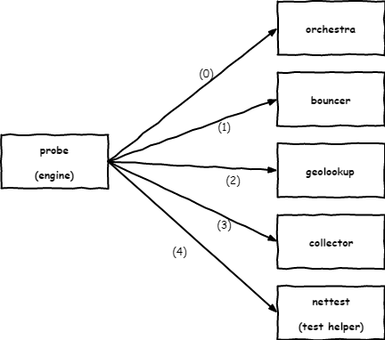

# OONI probe specification

* version: 3.0.0
* date: 2019-05-09
* authors: Simone Basso

The purpose of this document is to explain how OONI probe works. We're
using version 3.0.0 because it's intended that version 2.0.0 is described
by the existing implementations, and this version is meant to be the
reference for upcoming code changes to match this spec.

This document should serve as an introduction for the interested reader
to the OONIverse. We will strive to keep it current, but it will inherently
age quicker than more specific specifications. Please, let us know if some
parts of this document have become obsolete and we didn't notice.

## Architecture

### Probe

The probe is the software running network tests (aka nettests). The probe
is an app for mobile or a desktop app. Current implementations are:

- [github.com/ooni/probe-android](https://github.com/ooni/probe-android)
for Android devices, written in Java;

- [github.com/ooni/probe-ios](https://github.com/ooni/probe-ios)
for iOS devices, written in ObjectiveC;

- [github.com/ooni/probe-legacy](https://github.com/ooni/probe-legacy)
for Desktop (legacy implementation), written in Python;

- [github.com/ooni/probe-cli](https://github.com/ooni/probe-cli)
command line interface for Desktop (new implementation);

- [github.com/ooni/probe-desktop](https://github.com/ooni/probe-desktop)
graphical user interface for Desktop (new implementation). This is
based on probe-cli.

### Engine

The engine is the piece of code running nettests. A specific implementation
of the probe uses an engine. Current implementations are:

- [github.com/measurement-kit/measurement-kit](
https://github.com/measurement-kit/measurement-kit) C++ engine
used for probe-android, probe-ios, probe-cli;

- [github.com/measurement-kit/engine](https://github.com/measurement-kit/engine)
experimental Go engine containing code that is not practical to write in C++,
which will be used by probe-android, probe-ios, probe-cli;

- [github.com/ooni/probe-legacy](https://github.com/ooni/probe-legacy)
which contains its own engine written in Python.

The operations discussed here are valid for all implementations.

### Orchestra

The [orchestra](../backends/bk-002-orchestra.md) is a
set of servers used to provide probes with input for
automatic network tests. This is currently experimental.

### Geolookup

The geolookup is a set of servers and databases used to discover the
probe's IP, ASN (autonomous system number), CC (country code), and
network name (name of the entity owning the ASN).

### Bouncer

The [bouncer](../backends/bk-004-bouncer.md)
is a set of servers used by the probe to discover the
collector and the test helper.

### Collector

The [collector](../backends/bk-003-collector.md)
is a set of servers to which the probe submits the
results of nettests.

### Test helpers

The test helpers are a set of servers useful to perform specific nettests. Their
specs is available [as part of this repository](../backends). We only consider
test helpers the servers that are under OONI control. Other servers will be
used as part of our testing.

## Nettest flow

### Orchestra

Nettests are either user initiated or automatically initiated when
using the orchestra. Interaction (0) describes when the probe communicates
with orchestra to get information such as what test to run and with
which input. Users can choose whether to enable orchestra. The specific
policy for doing that depends on the app. (As of this writing, we have
not finished implementing all of orchestra yet).

Discovering the input for the test is also part of orchestra. For example,
there is an orchestra endpoint for discovering the list of URLs that
needs to be tested when performing [Web Connectivity](
../nettests/ts-017-web-connectivity.md) tests. As of this
writing, we're increasingly going towards using this functionality to
decide what URLs to test rather than using static URLs shipped inside of
the mobile and Desktop apps.

When the test name and its input are known, we can move forward with
the following steps.

### Bouncer

The engine contacts the bouncer, as shown in interaction (1). This will
tell the engine the available collectors and test helpers.

### Geolookup

Unless configured to skip this step, the engine will perform a geolookup
as shown in interaction (2). The purpose of geolookup is to know the
user IP, which is by default not included into the report, and information
that can be guessed from the IP, like the ASN, the CC, etc. Knowing the
IP also allows the engine to attempt to scrub the IP from the results, when
the user has requested the engine not to include their IP (which is the
default). In this document we don't want to the details of our [data
policy](https://ooni.io/about/data-policy/), which you can read separately; when
in doubt, the data policy will always have precedence over this document, which
is mainly meant to explain to new developers how all the pieces fit together.

### Opening a report

At this point, the engine will contact the collector, interaction (3), to
open a report for the specific nettest. This means that the collector will
be prepared for receiving and storing the results of the nettest. In code
terms, this means the collector will tell the engine the ID of the report, to
be used to submit measurements as part of this report.

### Nettesting

When the report is open, the engine will perform the nettest. It may or
may not use test helpers, depending on the nettest. This is modeled by
interaction (4). Depending on the nettest, there will be or will not be
inputs, and there will be or not be test helpers. Two examples:

1. if you run a [Web Connectivity](
..//nettests/ts-017-web-connectivity.md), this will require one or more URLs
as input. The engine will access those URLs and use a specific test helpers
to also access those URLs and have a comparison. The results of comparing
the engine and the test helper measurement will become the result of the
web measurement;

2. if you run a [NDT test](../nettests/ts-022-ndt.md), there will be no input
and no OONI controlled test helper. However, the test will measure the performance
between the engine and a measurement server (which we don't consider a
test helper because is not directly controlled by OONI). The performance
measurements will be included into the results.

Nettests that require input produce one measurement for each input. Instead,
when there is no input, the nettest produces a single measurement. In this
context, a measurement is a JSON document. The specification of the data
format used by measurements is described [in this repository](
../data-formats) and every [nettest](../nettests) includes its
specific pieces of data on top of the general data format.

### Submitting measurements

Measurements produced by nettests are submitted to the OONI collector in
the context of the previously openned report. This is again interaction
(3), where the ID of the report is used to submit measurements.

### Closing report and beyond

Finally, the engine tells the collector to close the report (again
interaction 3). This means the report will not accept further measurements
using the previously communicated report ID. This will also trigger the
automatic archiving and processing of the measurements. These actions
are performed by the [OONI pipeline](
https://github.com/ooni/pipeline). Data are accessible through the [OONI
API](https://github.com/ooni/api) and browseable using the
[OONI explorer](https://github.com/ooni/explorer).
