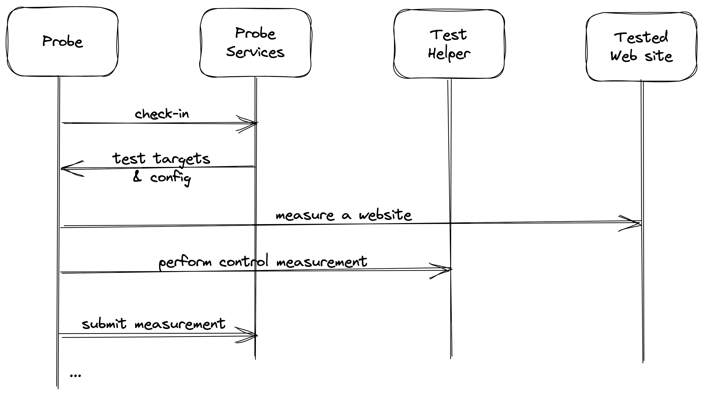

# OONI Probe specification

* version: 202108.20.1147
* authors: Simone Basso

This document should serve as an introduction for the developer interested in
contributing to OONI Probe.

## Software architecture

### Probe

The probe is the software running network tests (aka nettests). The probe
is an app for mobile or desktop. Current implementations are:

- [github.com/ooni/probe-android](https://github.com/ooni/probe-android):
app for Android devices, written in Java;

- [github.com/ooni/probe-ios](https://github.com/ooni/probe-ios):
app for iOS devices, written in ObjectiveC;

- [github.com/ooni/probe-cli](https://github.com/ooni/probe-cli):
command line interface for Desktop (new implementation);

- [github.com/ooni/probe-desktop](https://github.com/ooni/probe-desktop):
graphical user interface for Desktop (new implementation),
based on probe-cli;

- [github.com/ooni/probe-legacy](https://github.com/ooni/probe-legacy):
CLI/Desktop (legacy) implementation, written in Python.

### Engine

The engine is the piece of code running nettests. A specific implementation
of the probe uses an engine. Current implementations are:

- [github.com/ooni/probe-cli](https://github.com/ooni/probe-cli): private
engine written in Go along with public mobile API;

- [github.com/measurement-kit/measurement-kit](
https://github.com/measurement-kit/measurement-kit): C++ engine
historically used in the 2016-2020 time period;

- [github.com/ooni/probe-engine](https://github.com/ooni/probe-engine):
historical Go engine merged into probe-cli in early 2021;

- [github.com/ooni/probe-legacy](https://github.com/ooni/probe-legacy):
historical engine written in Python.

### OONI API Client

Client API for speaking with the OONI backends (aka *probe services*).

We specify these services in the [backends](../backends) directory.

### Geolocate Client

API to discover the probe's:

- IP address;

- ASN (autonomous system number);

- CC (country code);

- network name (entity owning the ASN).

We obtain the ASN, the CC, and the network name from the probe's IP address.

Modern probes (e.g., probe-cli) also discover:

- the IP address used by the system resolver;

- the corresponding ASN;

- the corresponding network name.

### Nettetsts

The nettests (aka experiments) are the network measurement experiments run
by a OONI Probe instance.

We specify them in the [nettests](../nettests) directory.

## Nettest flow

### Check-in

The Probe uses the OONI API Client to obtain the nettest targets and
configuration from the OONI backends. As part of checking in with the
backends, the Probe also obtains a *Report ID*. Such an ID will be
used later to identify related network measurements.

### Geolocation

The Probe uses the Geolocate Client to discover its IP address, ASN, CC,
and network name. Modern probes (e.g., probe-cli) also discover the
resolver's IP address, ASN, and network name.

### Measuring

The Probe uses the selected nettest API to perform a network measurement. Some
nettests (e.g., website-measuring nettests) take in input a list of targets, others
(e.g., network-performance nettests) do not. If the nettest takes
in input a list of targets, the Probe will perform a measurement for each
target. Otherwise the probe performs a single measurement.

### Measurement submission

The Probe uses the OONI API Client and the *Report ID* to submit measurements
to the OONI backends.

### Measurement processing

The OONI backends process the submitted measurements, store the raw
data files on S3 and exports them using the [OONI API](
https://github.com/ooni/api).
